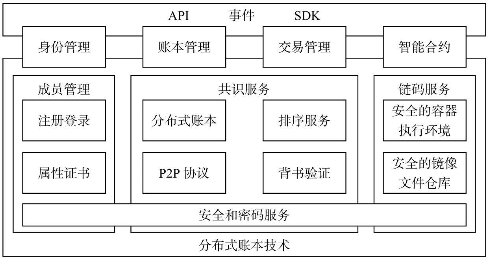

本系列默认Hyperledger Fabric 1.0。

Hyperledger Fabric 1.0是一种通用的区块链技术，其设计目的是利用一些成熟的技术实现分布式账本技术（Distributed Ledger Techonlogy DLT）。

超级账本采用模块化架构设计，复用通用的功能模块和接口。

模块化的方法带来了可扩展性、灵活性等优势，会减少模块修改、升级带来的影响，能很好地利用微服务实现区块链应用系统的开发和部署。

Hyperledger Fabric 1.0设计的几个特点：

| 特点 | 说明 |
| --- | --- |
| **模块插件化** | 1.**很多的功能模块**（如CA模块、共识算法、状态数据库存储、ESCC、VSCC、BCCSP等）**都是可插拔的，系统提供了通用的接口和默认的实现**，这满足了大多数业务的需求。  2.这些模块也可以通过需求进行扩展，集成到系统中。 |
| **充分利用容器技术** | 1.不仅节点使用容器做为运行环境，链码也默认运行在安全的容器中。  2.应用程序或者外部系统不能直接操作链码，必须通过背书节点提供的接口转发给链码来执行。|
| **可扩展性** | Hyperledger Fabric 1.0在0.6版本的基础上，对Peer节点的角色进行了拆分，有背书节点（Endorser）、排序服务节点（Orderer）、记账节点(Committer)等，不同角色的节点有不同的功能。  节点可以加入到不同的通道（Channel）中，链码可以运行在不同的节点上，这样可以更好地提升并行执行的效率和吞吐量。|
| **安全性** | Hyperledger Fabric 1.0提供的是授权访问的区块链网络，节点共同维护成员信息，MSP(Membership Service Provider)模块验证、授权了最终用户后才能使用区块链网络的功能。  多链和多通道的设计容易实现数据隔离，也提供了应用程序和链码之间的安全通道，实现了隐私保护。|

## 系统逻辑架构
下图是 Hyperledger Fabric 1.0设计的系统逻辑架构图：

该图是从不同角度来划分的：上层从应用层程序的角度，提供了标准的gRPC接口，在API的基础上封装了不同语言的SDK，包括Golang、Node.js、Java、Python等，开发人员可以利用SDK开发基于区块链的应用。

区块链强一致性要求各个节点之间达成共识需要较长的执行时间，也是采用异步通信模式进行开发的，事件模块可以在触发区块事件或者链码事件的时候执行预先定义的回调函数。

### 应用程序角度

#### **1.身份管理**

- 用户注册和登录系统后，获取到用户注册证书（ECert），其他所有的操作都需要与用户证书关联的私钥进行签名。

- 消息接收方首先会进行签名验证，才进行后续的消息处理。

- 网络节点同样会收到颁发的证书，比如系统启动和网络节点管理等都会对用户身份进行认证和授权。

#### **2.账本管理**

**授权的用户是可以查询账本数据（ledger）**的，这可以通过多种方式查询，包括：根据区块号查询区块、根据区块哈希查询区块、根据交易号查询区块、根据交易号查询交易、还可以根据通道名称获取查询到的区块链信息。

#### **3.交易管理**

账本数据只能通过交易执行才能更新，应用程序通过交易管理提交交易提案（Proposal）并获取到交易背书（Endorsement）以后，再给排序服务节点提交交易，然后打包生成区块。

SDK提供接口，利用用户证书本地生成交易号，背书节点和记账节点都会校验是否存在重复交易。

#### **4.智能合约**

实现“可编程的交易账本”（Programmable Ledger），**通过链码执行提交的交易，实现基于区块链的智能合约业务逻辑**。

**只有智能合约才能更新账本数据**，其他模块是不能直接修改状态数据（World State）的。

### 底层角度

从1.0底层的角度来看，如何实现分布式账本技术，给应用程序提供区块链服务：

#### **1.成员管理**

MSP（Membership Service Provider）对成员管理进行了抽象。

每个MSP都会建立一套根信任证书（Root of Truest Certificate）体系，利用PKI(Public Key Infrastructure)对成员身份进行认证，验证成员用户提交交易请求的签名。

结合Fabric-CA或者第三方CA系统，提供成员注册功能，并对成员身份证书进行；管理，例如证书新增和撤销。

注册的证书分为注册证书（ECert）、交易证书（TCert）和TLS证书（TLS Cert），它们分别用于用户身份、交易签名和TLS传输。

#### **2.共识服务**

在分布式节点环境下，要实现同一个链上不同节点区块的一致性，同时要确保区块里的交易有效和有序。

共识机制由3个阶段完成：

- 客户端向背书节点提交交易案进行签名背书；

- 客户端将背书后的交易提交给排序服务节点进行交易排序，生成区块和排序服务；

- 之后广播给记账节点验证交易后写入本地账本。

网络节点的P2P协议采用的是基于Gossip的数据分发，以同一组织为传播范围来同步数据，提升网络传输的效率。

#### **3.链码服务**

智能合约的实现依赖于安全和执行环境，确保安全的执行过程和用户数据的隔离。

Fabric采用Docker管理普通的链码，提供安全的沙箱环境和镜像文件仓库。

其好处是容易支持多种语言的链码，扩展性很好。

Docker方案的也有不足，如：对环境要求较高，占用资源较多，性能不高等，实现过程也存在与Kubernetes、Rancher等平台的兼容性问题。

#### **4.安全和密码服务**

Fabric 1.0专门定义了一个BCCSP(BlockChain Cryptographic Service Provider)，使其实现秘钥生成、哈喜运算、签名验签、加密解密等基础功能。

BBSCP是一个抽象接口，默认是软视线的国标算法，目前社区和较多的厂商都在实现国密的算法和HSM(Hardware Security Module)。

