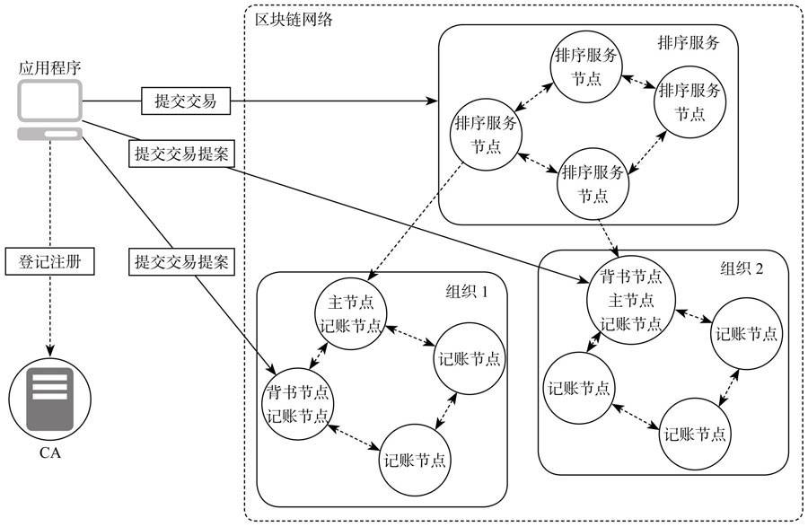

节点是区块链的通信主体，是一个逻辑概念。多个不同类型的节点可以运行在同一物理服务器上。有多种类型的节点：客户端、Peer节点、排序服务节点和CA节点。下图为网络节点架构图2-1：

## 客户端节点

客户端或者应用程序代表有最终用户操作的实体。

- 它必须连接到某一个Peer节点或者排序服务节点上与区块链网络进行通信。
- 客户端向背书节点（Endorser）提交交易提案（Transaction Proposal），
- 当收集到足够背书后，向排序服务广播结义，进行排序，生成区块。

## Peer节点

所有的Peer节点都是记账节点（Committeer），负责验证从排序服务节点区块里的交易，维护状态数据和账本的副本。

**部分节点会执行交易并对结果进行签名背书，充当背书节点**。背书节点是动态的角色，是与具体链码绑定的。每个链码在实例化的时候都会设置背书策略，指定哪些节点对交易背书后才是有效的。也只有在应用程序向它发起交易背书请求的时候才是背书节点，其他的时候就是普通的记账节点，只负责验证交易并记账。

图2-1所示的Peer节点**还有一种角色是主节点（Leader Peer）**，代表的**是和排序服务节点通信的节点**，负责**从排序服务节点处获取最新的区块并在组织内部同步**。可以强制设置为主节点，也可以动态选举产生。

有的节点同时是背书节点和记账节点，也可以同时是背书节点、主节点和记账节点，也可以只是记账节点。

## 排序服务节点

排序服务节点（Ordering Service Node或者Orderer）接收包含背书签名的交易，对未打包的交易进行排序生成区块，广播给Peer节点。

排序服务提供的是**原子广播（Atomic Broadcast）**，保证同一个链上的节点接收到相同的消息，并且有相同的逻辑顺序。

排序服务的**多通道（MultiChannel）**实现了多链的数据隔离，保证只有同一个链的Peer节点才能访问链上的数据，保护用户隐私。

排序服务可以采用集中式服务，也可以采用分布式协议。

可以实现不同级别的容错处理，目前正式发布的1.0版本只支持Apache Kafka集群，提供交易排序的功能，只实现CFT(Crash Fault Tolerance，崩溃故障容错)，不支持BFT(Byzantime Fault Tolerance，拜占庭容错)。 现在是通过Kafka/ Zookeeper实现的CFT，未来将提供基于 etcd/Raft 的[Raft共识订购服务](https://raft.github.io/#implementations)以及完全分散的BFT订购服务

##CA节点

CA节点是Hyperledger Fabric1.0的证书颁发机构（Certificate Authority），由服务器和客户端组件组成。

CA节点接收客户端的注册申请，返回注册密码用于用户登录，以便获取身份证书。

在区块链网络上所有的操作都会验证用户的身份。

CA节点是可选的，可以用其他成熟的第三方CA颁发证书。
