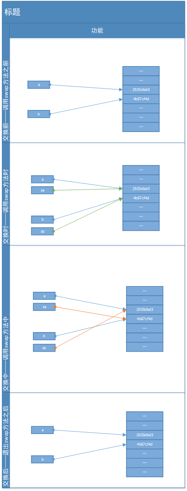
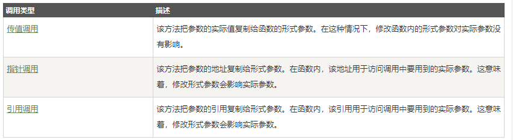

《Head First Java》中关于 Java 参数传递的说明：

>**Java 中所传递的所有东西都是值**，但此值是变量所携带的值。引用对象的变量所携带的是远程控制而不是对象本身，**若你对方法传入参数，实际上传入的是远程控制的拷贝**。

《Java编程思想 第四版》中第二章第一节“用引用操作对象”中写到：

> 尽管一切都看作对象，但操作的标识符实际上是一个对象的引用（reference）。

文中用遥控器（引用）操作电视（对象）为例形象的说明了该引用名词的含义，同时在对定义的“引用”该名词的注释中提到：

> 有人认为：“很明显，它是一个指针。”但是这种说法是基于底层实现的某种假设。并且，**Java中的引用，在语法上更接近C++的引用而不是指针**。

> 还是有很多人不同意用“引用”这个术语。我**曾读到的一本书中这样说：“Java所支持的‘按址传递’是完全错误的”，因为Java对象标识符（按那位作者所说）实际上是“对象引用”。并且他接着说任何事物都是“按值传递”的**。也许有人会赞成**这种精准却让人费解的解释**，但我认为我的这种方法可以**简化概念上的理解**并且不会伤害到任何事物。

对于基本类型（int等）没用争议，肯定是值传递。但String、基本类型的封装类（Integer等）、自定义类（如User等）传递的是一个地址，这就容易让人联想到C++中的指针传递和引用传递。以一个User类为例：

```java
public class User {
    private String name;
    private int age;
    private Integer height;

    public User(String name, int age, Integer height) {
        this.name = name;
        this.age = age;
        this.height = height;
    }

    // ......

    // 省略了无参构造函数、所有set/get函数。

    // ......

    @Override
    public String toString() {
        return "User{" +
                "name='" + name + '\'' +
                ", age=" + age +
                ", height=" + height+'\'' +
                ", address=" + super.toString() +
                '}';
    }
}

```
### 示例1：

```java
public class MainDemo {
    public static void main(String[] args) {
        User a = new User("a",10,10);
        User b = new User("b",11, 11);
        PrintUtill.println("交换前：");
        PrintUtill.println("a: "+a);
        PrintUtill.println("b: "+b);
        PrintUtill.printlnRule();
        swap(a,b);
        PrintUtill.println("交换最后：");
        PrintUtill.println("a: "+a);
        PrintUtill.println("b: "+b);
        PrintUtill.printlnRule();
        change(a);
        PrintUtill.println("修改最后：");
        PrintUtill.println("a: "+a);
    }

    public static void swap(Object sa, Object sb){
        Object sc = sa;
        sa = sb;
        sb = sc;
        PrintUtill.println("交换中：");
        PrintUtill.println("sa: " + sa);
        PrintUtill.println("sb: " + sb);
        PrintUtill.printlnRule();
    }


}
```

**结果**：

```shell
交换前：
a: User{name='a', age=10, height=10', address=Others.base.common.User@2503dbd3}
b: User{name='b', age=11, height=11', address=Others.base.common.User@4b67cf4d}

--------windcoder.com----------

交换中：
sa: User{name='b', age=11, height=11', address=Others.base.common.User@4b67cf4d}
sb: User{name='a', age=10, height=10', address=Others.base.common.User@2503dbd3}

--------windcoder.com----------

交换最后：
a: User{name='a', age=10, height=10', address=Others.base.common.User@2503dbd3}
b: User{name='b', age=11, height=11', address=Others.base.common.User@4b67cf4d}

--------windcoder.com----------
```

不管是断点跟踪还是最终打印出的结果，swap方法中确实做了交换（sa和sb的地址做了交换），但并未对方法外有任何影响（a和b的地址指向依旧是原来的未变）。

每个方法的运行都会在Java虚拟机栈中创建一个栈帧，里面存放了局部变量表等内容，方法的运行就是一个栈帧进栈出栈的过程。

如方法swap：
```java
public static void swap(Object sa, Object sb)
```

此时的sa,sb属于形参，就是形式参数，用于定义方法的时候使用的参数，用来接收调用者传递的参数。形参只有在方法被调用的时候，虚拟机才会分配内存单元，在方法调用结束之后便会释放所分配的内存单元。

换种说法，**当调用swap方法时，sa类似C++中的引用，成为地址2503dbd3的一个别名，亦既上面关于《思想》中的引用说的更接近引用而不是指针**，不同之处是一旦执行``` sa = sb;```，改变的仅是是sa的指向，对原地址2503dbd3不会造成任何影响。一旦方法执行完，sa被分配到内存单元便会被释放。该实例执行如图：



### **示例2：**

在示例1中追加代码后如下：

```java
public class MainDemo {
    public static void main(String[] args) {
        User a = new User("a",10,10);
        User b = new User("b",11, 11);
        // ......
        // 省略示例1中的代码
        // ......
        change(a);
        PrintUtill.println("修改最后：");
        PrintUtill.println("a: "+a);
    }
    public static void swap(Object sa, Object sb){
        
        // ...省略
        
    }
    public static void change(User sa){
        sa.setName("a2");
        sa.setAge(11);
        sa.setHeight(12);
        PrintUtill.println("修改中：");
        PrintUtill.println("sa: " + sa);
    }
}
```
**结果**：

```shell
// ......
// 省略之前的

交换最后：
a: User{name='a', age=10, height=10', address=Others.base.common.User@2503dbd3}
b: User{name='b', age=11, height=11', address=Others.base.common.User@4b67cf4d}

--------windcoder.com----------

修改中：
sa: User{name='a2', age=11, height=12', address=Others.base.common.User@2503dbd3}
修改最后：
a: User{name='a2', age=11, height=12', address=Others.base.common.User@2503dbd3}

```

此时函数内发生了变化影响到函数外的数据，change方法外的a和方法的参数sa指向的均是地址2503dbd3，指向未发生变化，但函数中的操作导致所指向的地址2503dbd3中的内容发生了变化，

### 示例3

```java
public class ListDemo {
    public static void main(String[] args) {
        List<String> list = null;
        // List<String>  list = new ArrayList<String>();
        add(list);
        list.add("3");
        list.add("4");
        PrintUtill.println("list.size:" + list.size());
    }

    public static void add(List<String> list){
        if (list==null){
            list = new ArrayList<String>();
        }
        list.add("1");
        list.add("2");
    }
}
```
该示例中list最开始为null，意味着没有地址，当作为实参传进add方法中，add.list没有地址，从而执行了``` list = new ArrayList<String>();```，add.list被分配了新的地址，当执行完add方法，add.list就会被释放，但main.list仍旧为空，从而导致NullPointerException(空指针异常)。

## 扩展

C++中函数参数的几种类型：



## 参考地址

[Java 中的参数传递和引用类型](https://segmentfault.com/a/1190000016360636#articleHeader6)

[C++ 函数](http://www.runoob.com/cplusplus/cpp-functions.html#%E5%87%BD%E6%95%B0%E5%8F%82%E6%95%B0)
