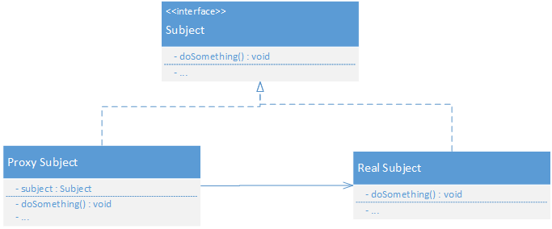
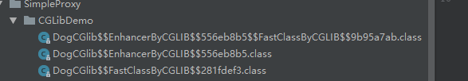

## 静态代理



- Subject：抽象角色。可以是接口，也可以是抽象类。声明真实对象（Real Subject）和代理对象(Proxy Subject)的共同接口。
- Real Subject：真实角色。定义代理角色所代表的真实实体，即最终要引用的对象。
- Proxy Subjcet：代理角色。包含真实对象的引用，负责对真实对象的调用，并在真实对象处理前后做预处理与善后工作；提供与真是对象（Real Subject）相同的接口以便任何时候都可以代替真实实体。

为保持行为的一致性，代理角色与真实角色通常会实现相同的接口。

详细代码实例请见:[Java代理1 代理和动态代理的基础与使用](https://windcoder.com/javadailiyudongtaidailiyi) 中的静态代理部分。

### 优点
- 职责清晰：真是角色只需关注业务逻辑的实现。非业务逻辑的部分交给后期的代理角色即可。
- 高扩展：可以在不修改真实对象的前提下，对目标功能扩展。

### 缺点
- 代理角色的一个接口对应一种类型的对象（即代理角色与真实角色通常会实现相同的接口），如果要代理的过多，就会产生大量的类，从而导致类的急速膨胀。
- 接口添加一个方法后，所有实现类都要实现该方法，所有的代理类也需要实现该方法。增加了代码维护的复杂度。

## JDK Proxy动态代理

在使用动态代理时，需要定义一个位于代理类与委托类之间的中介类，也叫动态代理类，该类被要求实现InvocationHandler接口。

当调用代理类对象的方法时，这个“调用”会转送到中介类的invoke方法中。参数proxy为调用method的代理实例(即动态生成的那个代理类)，method标识了我们具体调用的是代理类的哪个方法，args为这个方法的参数。

```java
public Object invoke(Object proxy, Method method, Object[] args) throws Throwable
```

一个典型的动态代理可分为以下四个步骤：

- 创建抽象角色（如：Animal）
- 创建真实角色(如：Dog)
- 通过实现InvocationHandler接口创建中介类（如：DynamicProxyHandler）
- 通过场景类，动态生成代理类（如：SimpleDynamicProxy）

详细代码实例请见:[Java代理2 动态代理的实现原理分析](https://windcoder.com/javadailierdongtaidailideshixianyuanlifenxi)

在场景类中通过如下代码动态产生了一个代理类，并返回了其实例：
```java
    Animal prox = (Animal) Proxy.newProxyInstance(
            Animal.class.getClassLoader(),
            new Class[]{Animal.class},
            new DynamicProxyHandler(dog)
    );
```

Proxy的newProxyInstance主要业务逻辑为：

```java
// 1 获得与传入的指定类装载器（loader）和接口列表（intfs）相关的代理类类型对象，亦既生成代理类class,并加载到JVM中
Class<?> cl = getProxyClass0(loader, intfs);
// 2 通过反射获取该代理类的构造函数，亦既获取代理类的参数类型为InvocationHandler的构造函数
final Constructor<?> cons = cl.getConstructor(constructorParams);
// 3 返回这个新的代理类的一个实例，亦既生成并返回代理类实例
return cons.newInstance(new Object[]{h});
```

具体做的事有:

- 根据传入的参数interfaces动态生成一个类，它实现interfaces中的接口，该例中即Animal接口的doBark方法和somethingElse方法。假设动态生成的类为$Proxy0。
- 通过传入的classloder（该例中即Animal.class.getClassLoader()）,将刚生成的$Proxy0类加载到jvm中。
- 利用中介类，调用$Proxy0的$Proxy0(InvocationHandler)构造函数，创建$Proxy0类的实例，其InvocationHandler属性，为我们创建的中介类。

其核心为getProxyClass0方法。

```java
    /**
     * Generate a proxy class.  Must call the checkProxyAccess method
     * to perform permission checks before calling this.
     */
    private static Class<?> getProxyClass0(ClassLoader loader,
                                           Class<?>... interfaces) {
        // 校验接口数量
        if (interfaces.length > 65535) {
            throw new IllegalArgumentException("interface limit exceeded");
        }
        // 从缓存中获取，如果没有就通过ProxyClassFactory创建
        // If the proxy class defined by the given loader implementing
        // the given interfaces exists, this will simply return the cached copy;
        // otherwise, it will create the proxy class via the ProxyClassFactory
        return proxyClassCache.get(loader, interfaces);
    }
```
Proxy类中有一属性proxyClassCache，这是一个java.lang.reflect.WeakCache类型的静态变量，其指示了类加载器和代理类之间的映射。proxyClassCache的get方法用于根据类加载器来获取Proxy类，如果已经存在则直接从cache中返回，如果没有则创建一个映射并更新cache表。          

proxyClassCache的get方法supplier.get() 当是创建代理类时，supplier为是Factory,这个类定义在WeakCach的内部。Factory中get方法又通过 ```value = Objects.requireNonNull(valueFactory.apply(key, parameter));``` 调用了 ```java.lang.reflect.Proxy.ProxyClassFactory``` 的apply方法（valueFactory即ProxyClassFactory）。

最终通过apply中的如下语句生成代理类。
```java
 byte[] proxyClassFile = ProxyGenerator.generateProxyClass(
                proxyName, interfaces, accessFlags);
```
 ProxyGenerator.generateProxyClass方法可以不填写最后一个参数，从而我们可以通过如下代码手动生成代理类。
```java
 byte[] classFile = ProxyGenerator.generateProxyClass("$Proxy0",
                Dog.class.getInterfaces());
```

JDK的动态生成的代理类均会继承Proxy类，由于java的单继承特性，故之后只能跟随实现接口，从而只能代理实现了接口的类。

## CGLIB代理

JDK动态代理只能代理实现了接口的类。

CGLIB动态代理针对类实现代理，原理是对目标类生成一个子类，并覆盖其中方法实现增强，由于是继承，无法对final修饰的类进行代理。

### 实现步骤

- 创建目标对象（如：DogCGlib）
- 通过实现MethodInterceptor接口创建中介类（如：CGlibProxy）
- 通过场景类，动态生成代理类（如：CGLIBDemo）

详细代码实例请见:[Java代理1 代理和动态代理的基础与使用](https://windcoder.com/javadailiyudongtaidailiyi) 中的CGLIB动态代理部分。

在场景类中通过如下代码动态产生了一个代理类，并返回了其实例：

```java
 // proxy为CGlibProxy实例，即CGlibProxy proxy = new CGlibProxy();
 DogCGlib dog = (DogCGlib)proxy.getInstance(DogCGlib.class);
```

getInstance要做的事有：

- 创建Enhancer实例
- 通过setSuperclass设置目标类
- 通过setCallback设置拦截对象
- create方法生成Target的代理类，并返回代理类的实例

Enhancer是CGLib的字节码增强器，可以方便的对类进行扩展，内部调用```GeneratorStrategy.generate```方法生成代理类的字节码，通过以下方式可以生成class文件：

```java
 System.setProperty(DebuggingClassWriter.DEBUG_LOCATION_PROPERTY, "./tmp/");
```

具体生成如下:



其中DogCGlib$$EnhancerByCGLIB$$556eb8b5.class为生成的代理类，进去可见

```java
public class DogCGlib$$EnhancerByCGLIB$$556eb8b5 extends DogCGlib implements Factory {
    ...

    static void CGLIB$STATICHOOK1() {
        CGLIB$THREAD_CALLBACKS = new ThreadLocal();
        CGLIB$emptyArgs = new Object[0];
        Class var0 = Class.forName("Others.base.SimpleProxy.CGLibDemo.DogCGlib$$EnhancerByCGLIB$$556eb8b5");
        Class var1;
        Method[] var10000 = ReflectUtils.findMethods(new String[]{"equals", "(Ljava/lang/Object;)Z", "toString", "()Ljava/lang/String;", "hashCode", "()I", "clone", "()Ljava/lang/Object;"}, (var1 = Class.forName("java.lang.Object")).getDeclaredMethods());
        CGLIB$equals$2$Method = var10000[0];
        CGLIB$equals$2$Proxy = MethodProxy.create(var1, var0, "(Ljava/lang/Object;)Z", "equals", "CGLIB$equals$2");
        CGLIB$toString$3$Method = var10000[1];
        CGLIB$toString$3$Proxy = MethodProxy.create(var1, var0, "()Ljava/lang/String;", "toString", "CGLIB$toString$3");
        CGLIB$hashCode$4$Method = var10000[2];
        CGLIB$hashCode$4$Proxy = MethodProxy.create(var1, var0, "()I", "hashCode", "CGLIB$hashCode$4");
        CGLIB$clone$5$Method = var10000[3];
        CGLIB$clone$5$Proxy = MethodProxy.create(var1, var0, "()Ljava/lang/Object;", "clone", "CGLIB$clone$5");
        var10000 = ReflectUtils.findMethods(new String[]{"somethingElse", "(Ljava/lang/String;)V", "doBark", "()V"}, (var1 = Class.forName("Others.base.SimpleProxy.CGLibDemo.DogCGlib")).getDeclaredMethods());
        CGLIB$somethingElse$0$Method = var10000[0];
        CGLIB$somethingElse$0$Proxy = MethodProxy.create(var1, var0, "(Ljava/lang/String;)V", "somethingElse", "CGLIB$somethingElse$0");
        CGLIB$doBark$1$Method = var10000[1];
        CGLIB$doBark$1$Proxy = MethodProxy.create(var1, var0, "()V", "doBark", "CGLIB$doBark$1");
    }

    private MethodInterceptor CGLIB$CALLBACK_0;
    ...
    final void CGLIB$doBark$1() {
        super.doBark();
    }
    public final void doBark() {
        MethodInterceptor var10000 = this.CGLIB$CALLBACK_0;
        if (this.CGLIB$CALLBACK_0 == null) {
            CGLIB$BIND_CALLBACKS(this);
            var10000 = this.CGLIB$CALLBACK_0;
        }

        if (var10000 != null) {
            var10000.intercept(this, CGLIB$doBark$1$Method, CGLIB$emptyArgs, CGLIB$doBark$1$Proxy);
        } else {
            super.doBark();
        }
    }
    ...
}
```

每个被代理的方法都对应一个MethodProxy对象，methodProxy.invokeSuper方法最终调用委托类的doBark方法。

**JDK代理通过反射，CGLIB通过MethodProxy+FastClass方式（类似索引的方式直接调用委托类方法）实现方法调用**。

FastClass其实就是对Class对象进行特殊处理，提出下标概念index，通过索引保存方法的引用信息，将原先的反射调用，转化为方法的直接调用，从而体现所谓的fast。

CGLIB部分暂时跟不下去了，网上搜到的内容大量的同质化，扩展里面的前三篇相对来说同质化的内容少一些。由于有些内容还不明白，导致不能像JDK动态代理那样流畅。

问题如：

- 怎样通过生成的动态代理类调到intercept。
- 动态代理类如何与FastClass相结合的。

核心其实就是:
```java
 dog.doBark();
```
如何调到```MethodInterceptor.intercept```方法的，这个留给日后单独开一篇探索吧。

## 参考资料

[说说 JAVA 代理模式](http://www.importnew.com/26116.html)

[Java的三种代理模式](https://www.cnblogs.com/cenyu/p/6289209.html)

[java经典讲解-静态代理和动态代理的区别](https://blog.csdn.net/fangqun663775/article/details/78960545)

[Java三种代理模式：静态代理、动态代理和cglib代理](https://segmentfault.com/a/1190000011291179)

[Cglib动态代理实现原理](https://www.cnblogs.com/monkey0307/p/8328821.html)

### 扩展

* [CGLIB动态代理介绍](http://ifeve.com/cglib-desc/)
* [说说cglib动态代理](https://www.jianshu.com/p/13aa63e1ac95)
* [深入理解CGLIB动态代理机制](https://www.jianshu.com/p/9a61af393e41)

[6. 代理模式](https://design-patterns.readthedocs.io/zh_CN/latest/structural_patterns/proxy.html)

[Java动态代理机制详解](https://blog.csdn.net/w05980598/article/details/79491627)

[Java 8动态代理的新技巧（1）：为什么使用动态代理？](http://www.importnew.com/16670.html)

[Java Proxy 和 CGLIB 动态代理原理](http://www.importnew.com/27772.html)

[有点深度的聊聊JDK动态代理](https://juejin.im/post/5c637cc4f265da2dd773c3d6)

[Java源码分析——java.lang.reflect反射包解析(三)　动态代理、Proxy类、WeakCache类](https://blog.csdn.net/hackersuye/article/details/83545871)

[Spring学习总结（二）——静态代理、JDK与CGLIB动态代理、AOP+IoC](https://www.cnblogs.com/best/p/5679656.html)

[代理9 cglib demo分析以及methodProxy与Fastclass源码](https://www.jianshu.com/p/001f866a49d7)