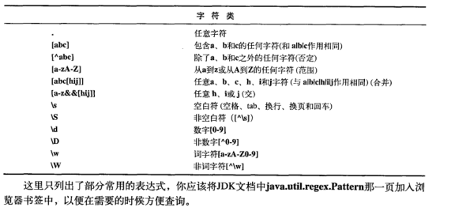

## 不可变

String对象是不可变的。每次修改都是创建了一个全新的String对象，以包含修改后的字符串内容，最初的String对象在原处丝毫未动。

对一个方法而言，参数是为该方法提供信息的，而不是想让该方法改变自己的。

## 重载“+”

内部并不是创建n个String对象，而是创建了一个StringBuilder对象，通过其append()方法连接，最后调用toStrong()方法返回。

该操作适用于单行“+”操作，不适用于循环（如for等）。因为在循环中，每次循环会生成一个新的个StringBuilder对象

javap反编译：
```
javap -c Concatenation
```

StringBuilder 是JavaSE5引入的，之前都是StringBuffer。后者是线程安全的，因此开销会大些，所以在javaSE5及以后中，字符串操作应该还会更快一点。

## 打印对象内存地址

不该调用this，而是应该调用 super.toString()方法。

原因：
```
public class WindCoderString {
	public String toString(){
		return "WindCoderString address:" + this + "\n";
	}
}
```
当运行```"WindCoderString address:" + this ```时，发生了自动类型转换，由WindCoderString类型转换为String类型。因为编译器看到String对象后面跟了一个“+”，而再后面的对象不是String，于是编译器试着将this转换成一个String,方式就是通过调用this上的toString()方法，于是发生了递归调用。

## String类的方法
当需要改变字符串的内容时，String类的方法都会返回一个新的String对象。
如果内容没有发生改变，则只是返回指向原对象的引用。
节约存储空间以及避免额外的开销。

## 常用正则
### 字符


### 字符类


### 逻辑操作符、边界匹配符


