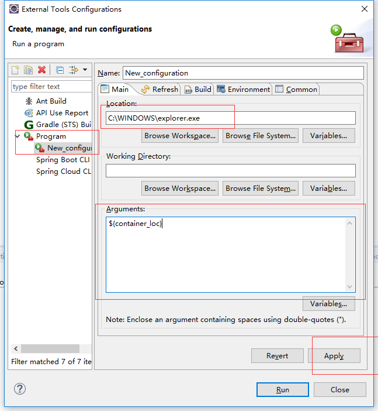
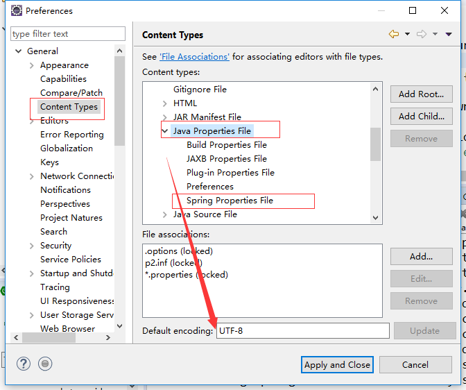

## 直接打开类文件/文件夹所在的本地目录

### 方案一
项目上右键->show in ->System Explorer

或者ALT+SHIFT +W ，在弹出的菜单中选择System Explorer

### 方案二

配置一个External Tool

1、Run --》ExternalTools --》External Tools Configurations

2、双击Program，新建一个Program。
3、设置新建的Program

location 里面填 ：C:\WINDOWS\explorer.exe 

Arguments 里面填: ${container_loc}

使用时点击以下图标即可

## 设置编码

### 整个工作空间
修改Workspace encoding & 换行符

Window ->Preference->Genera-->Workspace

Text file encoding 设为 UTF-8，

new text file line delimiter 设为 Unix

	
### Properties 文件
Window ->Preference->Genera-->Content Types-->Text -->Java Properties File

设置Default encoding，把下面的ISO-8859-1改为UTF-8,然后update,确认保存退出。

实际项目中，可能只配置Java Properties File，无法适用于Spring Properties File，此时需要单独配置一下其编码格式。

## 设置tab缩进
上面的是4空格缩进，下面是编辑在编辑窗口显示打印边距（换行参考线），非必选。

## 调整字体大小

### 控制台 

Window -> Preferences -> General -> Appearance -> Colors and Fonts -> Basic -> Text Font -> Edit 

### 调节主窗口字体大小。
 Window -> Preferences -> General -> Appearance -> Colors and Fonts -> Java -> Java Editor Text Font -> Edit
 
 [调整Eclipse字体大小](http://blog.csdn.net/magi1201/article/details/45921907)
 
 ## 取消校验（提升Eclipse响应）
 
 
 ### 移除JSON文件红叉(旧)
 	
以下为两种方案：

1. 关闭校验
	菜单Window - > Preferences
	然后搜索 validation 
	关闭对应的校验。

2. 关闭拼写检查
	在eclipse下的Window--Preference输入spell，然后把第一个复选框“Enable spell checking“给去掉就可以了。
	亦既：Window--》 Preferrnces–》General–》Editors–》Text Editors–》spelling，取消Enable spell checking选项
	[取消spell checking,提高eclipse运行速度](https://www.cnblogs.com/112ba/p/6220117.html)
	[eclipse 如何忽略json错误](https://zhidao.baidu.com/question/748903465308311892.html)
	
## xml 文件格式化（非必要）
