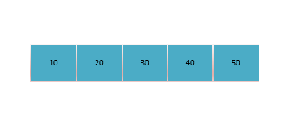
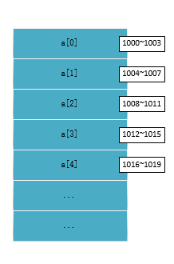

数组（Array）是一种**线性表**数据结构。它用一组**连续的内存空间**，来存储一组具有**相同类型的数据**。


- 因为**线性表**、**连续的内存空间和相同类型的数据**这两个特性，数组的随机访问速度快。
- 也因此，具有**低效的“插入”和“删除”**。

动态数组，是指数组的容量能动态增长的数组,对于Java而言，Collection集合中提供了ArrayList和Vector。

### 插入操作

若有一元素想往int[n]的第k个位置插入数据，需要将k~n位置的元素顺序往后移一位。


### 删除操作

### 链表与数组的区别：

- 链表适合插入、删除，时间复杂度 O(1);
- 数组支持随机访问，根据下标随机访问的时间复杂度为 O(1)。

### 容器（ArrayList）与数组的适用场景

ArrayList将所有数组操作封装起来，且支持动态扩容，每当空间不够时，自动扩容空间1.5倍。

- ```ArrayList``` 无法存储基本类型，比如 ```int、long```，需要封装为 ```Integer、Long``` 类，而 ```Autoboxing、Unboxing``` 则有一定的性能消耗，所以如果特别关注性能，或者希望使用基本类型，就可以选用数组。
- 如果数据大小事先已知，并且对数据的操作非常简单，用不到 ```ArrayList``` 提供的大部分方法，也可以直接使用数组。
- 表示多维数组时，用数组往往会更加直观。比如 ```Object[][] array```；而用容器的话则需要这样定义：```ArrayList<ArrayList> any```

### 数组下标从0开始

```int[] a = {10,20,30,40,50}``` 的存储示例如下：




计算机会给每个内存单元分配一个地址，计算机通过地址来访问内存中的数据。当计算机需要随机访问数组中的某个元素时，它会首先通过下面的寻址公式，计算出该元素存储的内存地址:

```
a[i]_address = base_address + i * data_type_size
```

其中，data_type_size是数组中每个元素的大小。

假设计算机为上面的数组```int[] a```分配了一块连续的内存空间1000~1019,首地址为base_address = 1000，因为是int类型，这里的data_type_size为4个字节,其内存空间分配如图：




如果数组下标从1开始，计算公式将成为如下：
```
a[k]_address = base_address + (k-1)*type_size

```
从 1 开始编号，每次随机访问数组元素都多了一次减法运算,对于 CPU 来说，就是多了一次减法指令。但更多的可能是由于历史原因，C的设计者使用了0作为下标开始，Java沿用了该设计。

### 结语

这里主要从数据结构角度介绍了一下数组，其它的数组知识点可以看下面两篇文章：

> [Java漫谈-数组](https://windcoder.com/javamantan-shuzu)
>
> [[转]Java中的数组是对象吗？](https://windcoder.com/javazhongdeshuzushiduixiangma)

本文参考资料

