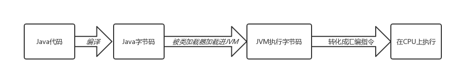
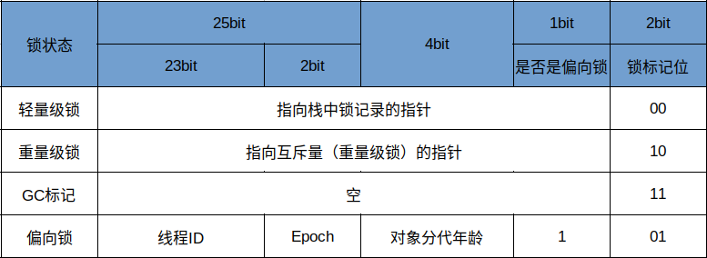
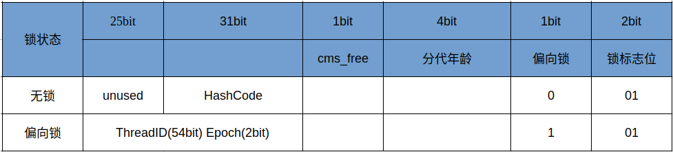

# 并发编程学习笔记01-Java并发机制的底层原理之volatile

>该并发学习系列以阅读《Java并发编程的艺术》一书的笔记为蓝本，汇集一些阅读过程中找到的解惑资料而成。这是一个边看边写的系列，有兴趣的也可以先自行购买此书学习。

Java中所示的并发机制依赖于JVM的实现和CPU的指令。


## Volatile
### 相关术语
**Volatile**是轻量级的synchronize，在多处理器开发中保证了共享变量的“可见性”。

**可见性**的意思是当一个线程修改一个共享变量时，另外一个线程能读到这个修改的值。
**共享变量**是指可以在多线程中共享的变量。所有的实例变量(Instance Fields)、静态变量(Static Fields)、数组元素(Array Elements)都属于共享变量。局部变量(Local Variables)、形式参数(Formal Method Parameneters)和异常处理器参数（Exception Handler Paramenters）永远不会在线程之间共享,并且不受内存模型（Memory Model）的影响。        
#### 相关CPU术语
| 术语 |  英文单词  | 术语描述|
| --- | --- | --- |
| 内存屏障 | memory barriers | 是一组处理器指令，用于实现对内存操作的顺序限制。 |
| 缓存行 | cache line | CPU高速缓存（一般分为一级和二级,现在更多的CPU提供了三级缓存）中可以分配的最小存储单位。处理器填写缓存行时会加载整个缓存行，现代CPU需要执行几百的CPU指令。|
| 原子操作 |  atomic operations |  不可中断的一个或一系列操作。 |
| 缓存行填充 | cache line fill | 当处理器识别到内存中读取操作数是可缓存的，处理器读取整个缓存行到适当的缓存（L1，L2，L3或所有）中。|
| 缓存命中 | cache hit | 如果进行高速缓存行填充操作的内存位置仍然是下次处理器访问的地址时，处理器从缓存中读取操作数，而不是从内存中读取。 |
| 写命中 | write hit | 当处理器将操作数写回到一个内存缓存的区域时，它首先会检测这个缓存的内存地址是否在缓存行中，如果存在一个有效的缓存行，则处理器将这个操作数写回到缓存，而不是写回到内存，这个操作被称为写命中。 |
| 写缺失 | write misses the cache | 一个有效的缓存行被写入到不存在的内存区域。 |
| 操作数 | operand | 它可能指定了参与操作的寄存器、内存地址或者立即数（litera data）。操作数还可能包括寻址方式，寻址方式确定操作数的含义。|
| 操作码 | opcode | 指定了要进行什么样的操作，例如“将存储器中的内容与寄存器中的内容相加”| 
| 指令 | Instruction  |传统的架构上，指令包含一个操作码和零个或更多的操作数。 | 

### 官方定义（[$8.3.1.4](https://docs.oracle.com/javase/specs/jls/se8/html/jls-8.html#jls-8.3.1.4)）
Java编程语言允许线程访问共享变量。通常，为了确保共享变量能被一致且准确地更新，线程应通过获取锁来确保自己独占此变量，该锁通常会对这些共享变量实施互斥（即该锁为排它锁）。

Java编程语言提供了第二种机制，即Volatile字段，在某些情况下比锁更方便。

若一个字段被声明为volatile，Java内存模型可确保所有线程看到这个变量的值是一致的。
###  实现原理
那么 volatile 是如何保证可见性呢？让我们看以下代码：
Java 代码如下：
```
instance = new Singleton() ; //instance 是 volatile 变量
```
转变为汇编如下:
```
0x01a3deld: movb $0x0,0x1104800(%esi);
0x01a3de24: lock addl $0x0,(%esp);
```
有volatile修饰的共享变量进行写操作时会多出第二行含Lock前缀指令的汇编代码。Lock前缀的指令在多核处理器下会引发两件事：

- 将当前处理器缓存行的数据写回到系统内存。
- 这个写回内存的操作会使在其他CPU里缓存了该内存地址的数据无效。

为提高处理速度，处理器不直接和内存进行通信，而是先将系统内存的数据读到内部缓存（L1，L2或其他）后再进行操作，但操作完全不知道何时会写到内存。

若对声明了volatile的变量进行写操作，JVM就会向处理器发送一条Lock前缀的指令，将这个变量所在缓存行的数据协会到系统内存。

在多处理器下，为了保证个处理器的缓存是一致的，就会**实现缓存一致性协议**，每个处理器**通过嗅探**在总线上传播的数据来检验自己缓存的值是不是过期了，当处理器发现自己缓存行对应的内存地址被修改，就会将当前处理器的缓存行设置成无效状态，当处理器对这个数据进行修改操作的时候，会重新从系统内存中把数据读到处理器缓存里。

以下为详解volatile的两条实现原则：

#### **Lock前缀指令引起处理器写回到内存**

Lock前缀指令导致在执行指令期间，声言处理器的LOCK#信号。

在多处理器环境中，LOCK#信号确保在声言该信号期间，处理器可以独占任何共享内存。因为它会锁住总线，导致其他CPU无法访问总线，无法访问总线即意味着不能访问系统内存。

在最近的处理器里，LOCK#信号一般不所总线，而是所缓存，毕竟锁总线开销比较大。

对于Intel486和Pentium处理器，在锁操作时，总是在总线上声言LOCK#信号。但在P6和目前的处理器中，如果访问的内存区域已经缓存在处理器内部，则不会声言LOCK#信号。相反，它会锁定这块内存区域的缓存并回写到内存，并使用缓存一致性机制来确保修改的原子性，此操作被称为“**缓存锁定**”，缓存一致性机制会阻止同时修改由两个以上处理器缓存的内存区域数据。

#### **一个处理器的缓存会写到内存会导致其他处理器的缓存无效**

IA-32处理器和Intel64处理器使用**MESI(修改、独占、共享、无效)控制协议**去维护内部缓存和其他处理器缓存的一致性。

在多核处理器系统中进行操作时，IA-32和Intel64处理器能嗅探其他处理器访问系统内存和它们的内部缓存。处理器使用嗅探技术保证它的内部缓存、系统内存和其他处理器的换错的数据在总线上保持一致。

## 参考资料

1. [《Java并发编程的艺术》勘误和支持](http://ifeve.com/book/)

2. [指令-wiki
](https://zh.wikipedia.org/wiki/指令)

3. [CPU体系架构-寻址方式](https://nieyong.github.io/wiki_cpu/CPU%E4%BD%93%E7%B3%BB%E6%9E%B6%E6%9E%84-%E5%AF%BB%E5%9D%80%E6%96%B9%E5%BC%8F.html)

# 并发编程学习笔记01-Java并发机制的底层原理之synchronized

synchronized实现同步的基础：**Java中的每一个对象都可以作为锁**。具体表现为三种形式：

- 对于普通同步方法，锁是当前实例对象。
- 对于静态同步方法，锁是当前类的Class对象。
- 对于同步方法块，锁是synchronized括号里配置的对象。

当一个线程试图访问同步代码块时，它首先必须得到锁，退出或抛出异常是必须释放锁。

JVM基于进入和退出Monitor对象来实现方法同步和代码块同步，两者实现细节不同，但都可使用 **```monitoreneter```** 和 **```monitorexit```** 这两个指令来实现。

- **monitorenter**指令是在编译后插入到同步块的开始位置。
- **monitorexit**指令是插入到方法结束处和异常处。
- JVM要保证每个monitorenter必须有对应的monitorexit与之配对。
- 任何对象都有一个monitor与之关联，且当一个monitor被持有后，它将处于锁定状态。
- 程序执行到monitorenter指令时，将会尝试获取对象所对应的monitor的所有权，即**尝试获得对象的锁**。

## Java对象头
synchronized用的锁是**存在Java对象头**里的。

- 若对象是数组类型，则虚拟机用3字宽（Word）存储对象头；
- 若对象是非数组类型，则用2字宽存储对象头。

在32位虚拟机中，1字宽等于4字节，即32bit。依次，在64位虚拟机中，1子宽为64bit。

Java对象头组成如下：
| 长度 | 内容 | 说明 | 备注 |
| --- | --- | --- | --- |
| 32/64 bit | Mark Word | 存储对象的hashCode或锁信息等 | 默认存储对象的HashCode、分代年龄和锁标记位。 |
| 32/64 bit  |Class Metadata Address | 存储对象的类型数据的指针 | 该指针指向对象的类元数据，JVM通过这个指针确定对象是哪个类的实例。|
| 32/64 bit  |  Array Length | 数组的长度（如果当前对象是数组）| j当且仅当对象是数组时才会有这部分。|

32位JVM的Mark Word的默认存储结构如下：
| 锁状态 | 25bit | 4bit | 1bit 是否是偏向锁 | 2bit 锁标记位 |
| --- | --- | --- | --- | --- |
| 无锁状态 | 对象的HashCode | 对象的分代年龄 | 0 | 01 |
运行期间，Mark Word 里存储的数据会随着锁标志位的变化而变化。可能会变成存储以下4种数据：




在64位虚拟机下，Mark Word是64bit大小的，其存储结构如下所示：



由此可见无锁状态和偏向锁状态时锁标志位均是01,只是在前面的1bit区域区分了当前是无锁状态还是偏向锁状态。

## 锁的升级与对比
Java SE 1.6为了减少获得锁和释放锁带来的性能消耗，引入了“偏向锁”和“轻量级锁”，以及锁升级的概念。

JDK1.6中，锁一共有4种状态，级别从低到高依次是：**无锁状态**、**偏向锁状态**、**轻量级锁状态**和**重量级锁状态**。

这几个状态会随着竞争情况逐渐升级。**锁可以升级但不能降级**。这种策略的目的是**为了提高获得锁和释放锁的效率**。

几种锁的优缺点对比如下：

| 锁 | 优点 | 缺点 | 适用场景 |
| --- | --- | --- | --- |
| 偏向锁 | 加锁和解锁不需要额外的消耗，和执行非同步方法相比仅存在纳秒级的差距。 |  如果线程间存在锁竞争，会带来额外的锁撤销的消耗。 |适用于只有一个线程访问同步块的场景。|
| 轻量级锁 | 竞争的线程不会阻塞，提高了程序的响应速度。 | 如果始终得不到锁竞争的线程，使用自旋会消耗CPU。| 追求响应时间；同步块执行速度非常快。|
| 重量级锁 | 线程竞争不使用自旋，不会消耗CPU。|线程阻塞，响应时间缓慢。| 追求吞吐量，同步块执行速度较长 |

### 偏向锁
大多数情况下锁不仅不存在多线程竞争，而且总是由同一个线程多次获得,故**为了让线程获得锁的代价更低而引入了偏向锁**。

当一个线程访问同步块并获取锁时，会在对象头和栈帧中的锁记录中存储锁偏向的线程ID，以后该线程在进入和退出同步块时不需要进行CAS操作来加锁和解锁，只需简单地测试一下对象头的Mark Word里是否存储着指向当前线程的偏向锁。

- 若测试成功，表示线程已经获得了锁。
- 若测试失败，则需要再测试一下Mark Word中偏向锁的标识是否设置成1：若没有设置，则使用CAS竞争锁；如果设置了，则尝试使用CAS将对象头的偏向锁指向当前线程。

