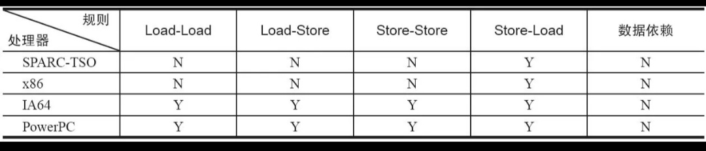

并发编程学习笔记04-内存模型基础

在并发编程中，需要处理两个关键问题：**线程之间如何通信**及**线程之间如何同步**。

在命令式编程中，线程之间的通信机制有两种：**共享内存**和**消息传递**。

同步是指**程序中用于控制不同线程间的操作发生相对顺序**的机制。

| 并发模型的通信机制 | 通信模式 | 同步形式|
| --- | --- | --- |
| 共享内存 | 线程之间共享程序的公共状态，通过写-读内存中的公共状态进行**隐式通信**。| **显式进行**。程序员必须显示指定某个方法或某段代码需要在线程之间互斥执行。 |
| 消息传递 | 线程之间没有公共状态，线程之间必须通过发送消息来进行**显式通信**。| **隐式进行**。因为消息的发送必须在消息的接收之前。 |

**Java的并发采用的是共享内存模型**，Java线程之间的通信总是隐式进行，整个通信过程对程序员完全透明。

## Java内存模型的抽象结构

在Java中，所有的实例域、静态域和数组元素都存储在堆内存中，堆内存在线程之间共享，这些变量可称为“共享变量”。

局部变量、方法形式参数和异常处理器参数不会再线程之间共享，它们不会有内存可见性问题，也不受内存模型的影响。

Java线程之间的通信由Java内存模型（本系列简称为JMM）控制，JMM决定一个线程对共享变量的写入何时对另一个线程可见。

从抽象角度看，JMM定义了线程和主内存之间的抽象关系：

- 线程之间的共享变量存储在主内存（Main Memory）中；
- 每个线程都有一个私有的本地内存（Local Memory）；
- 本地内存中存储了该线程已读/写共享变量的副本；

本地内存是JMM的一个抽象概念，并不真实存在。它涵盖了缓存、写缓冲区、寄存器以及其他的硬件和编译器优化。

如果线程A与线程B之间要通信，必须经历下面2个步骤：

- 1.线程A把本地内存A中更新过的共享变量刷新到主内存中。
- 2.线程B到主内存中读取线程A之前已更新的共享变量。

这两个步骤的实质是线程A向线程B发送消息，而且这个通信过程必须要经过主内存。**JMM通过控制主内存与每个线程的本地内存之间的交互**，来为程序员**提供内存可见性保证**。

## 从源代码到指令序列的重排序

在执行程序时，为了提高性能，编译器和处理器常常会对指令做重排序。重排序分3种类型：

- 1.**编译器优化的重排序**。编译器在不改变单线程程序语义的前提下，可以重新安排语句的执行顺序。
- 2.**指令级并行的重排序**。现代处理器曹勇了指令级并行技术（Instruction-Level Parallelism，ILP）来将多条指令重叠执行。如果不存在数据依赖性，处理器可以改变语句对应机器指令单执行顺序。
- 3.**内存系统的重排序**。由于处理器使用缓存和读/写缓冲区，这使得加载和存储操作看上去可能在乱序执行。

从java源代码到最终实际执行的指令序列，会分别经历下面3中重排序：

源代码->1:编译器优化重排序->2:指令级并行重排序->3:内存系统重排序->最终执行的指令序列。

上述的1属于编辑器重排序，2和3属于处理器重排序。这些重排序可能会导致多线程程序出现民族村可见性问题。

对于编辑器，JMM的编译器重排序规则会禁止特定类型的编译器重排序。

对于处理器重排序，JMM的处理器重排序规则会要求Java编译器在生成指令序列时，插入特定类型的内存屏障（Memory Barriers，Intel称之为Memory Fence）指令，通过内存屏障指令来禁止特定类型的处理器重排序。

**JMM属于语言级的内存模型，它确保在不同的编译器和不同的处理器平台之上，通过禁止特定类型的编译器重排序和处理器重排序**，为程序员**提供一致性的内存可见性保证**。

## 并发编程模型的分类
现代的处理器使用写缓冲区临时保存向内存写入的数据。

写缓冲区可以保证指令流水线持续运行，它可以避免由于处理器停顿下来等待向内存写入数据而产生的延迟。

同时，通过以批处理的方式刷新写缓冲区，以及合并写缓冲区中对同一内存地址的多次写，减少对内存总线的占用。

但，每个处理器上的写缓冲区仅对它所在处理器看见。这个特性会对内存操作的执行顺序产生重要影响：处理器对内存的读/写操作的执行顺序，不一定与内存实际发生的读/写操作顺序一致。

### 常见处理器允许的重排序操作

N表示处理器不允许两个操作重排序，Y表示允许重排序。

由上表可见：

- 常见的处理器都允许Store-Load重排序；
- 常见的处理器都不允许对存在数据依赖的操作做重排序。
- sparc-TSO和X86拥有相对较强的处理器内存模型，它们允许对写-读操作做重排序（因为它们都使用了写缓冲区）。
- sparc-TSO是指以TSO(Total Store Order)内存模型运行时sparc处理器的特性。
- 表中X86包含X64及AMD64。
- 由于ARM处理器的内存模型与PowerPC处理器的内存模型非常类似，这里忽略它。

为了保证内存可见性，Java编译器在生成指令序列的适当位置会插入内存屏障指令来禁止特定类型的处理器重排序。JMM把内存屏障指令分为4类：

| 屏障类型 | 指令示例 | 说明 |
| --- | --- | --- |
| LoadLoad Barriers | Load1;LoadLoad;Load2 | 确保Load1数据的装载先于Load2及所有后续装载指令的装载。|
| StoreStore Barriers | Store1;StoreStore;Store2 | 确保Store1数据对其他处理器可见（刷新到内存）先于Store2及所有后续存储指令的存储。 |
| LoadStore Barriers | Load1;LoadStore;Store2 | 确保Load1数据装载先于Store2及所有后续的存储指令刷新到内存 |
| StoreLoad Barriers | Store1;StoreLoad;Load2 | 确保Store1数据对其他处理器变得可见（指刷新到内存）先于Load2及所有后续装载只开的装载。StoreLoad Barriers会使该屏障之前的所有内存访问指令（存储和装载指令）完成之后，才执行该屏障之后的内存访问指令。 |

StoreLoad Barriers是一个“全能型”屏障，它同时具有其他3个屏障的效果。现代的多处理器大多数支持该屏障（其他类型的屏障不一定被所有处理器支持）。执行该屏障开销会很昂贵，因为第一期处理器通常要把写缓冲区的数据全部刷新到内存中（Buffer Fully Flush）。

## happens-before简介

从JDK5开始，Java使用心得JSR-133内存模型。JSR-133使用happens-before的概念来阐述操作之间的内存可见性。在JMM中，如果一个操作执行的结果需要对另一个操作可见，那么这两个操作之间必须要存在happens0before关系。这两个操作可以在一个线程之内，也可以是不同线程之间，

与程序员密切相关的happens-before规则如下：

- 程序顺序规则：一个线程中的每个操作，happens-before于该线程中的任意后续操作。
- 监视器锁规则：对于一个锁的解锁，happens-before于随后对这个锁的加锁。
- volate变量规则：对一个volate域的写，happens-before于任意后续对这个volate域的读。
- 传递性：如果A happens-before B，且B happens-before C，那么A happens-before C。
- start()规则：如果线程A执行操作ThreadB.start()(启动线程B)，那么A线程的ThreadB.start()操作happens-before于线程B中的任意操作。
- join()规则：如果线程A执行操作ThreadB.join()并成功返回，那么线程B中的任意操作happens-before于线程A从ThreadB.join()操作成功返回。

注意：

两个操作之间具有happens-before关系，并不意味着前一个操作必须要在后一个操作之前执行。

happens-before仅仅要求前一个操作（执行结果）对后一个操作可见，且前一个操作按顺序排在第二个操作之前。

一个happens-before规则对应一个或多个编译器核处理器的重排序规则。
happens-before规则简单易懂，避免了java程序员为了理解JMM提供的内存可见性保证而去学习复杂的重排序规则以及这些规则的具体实现方法。

