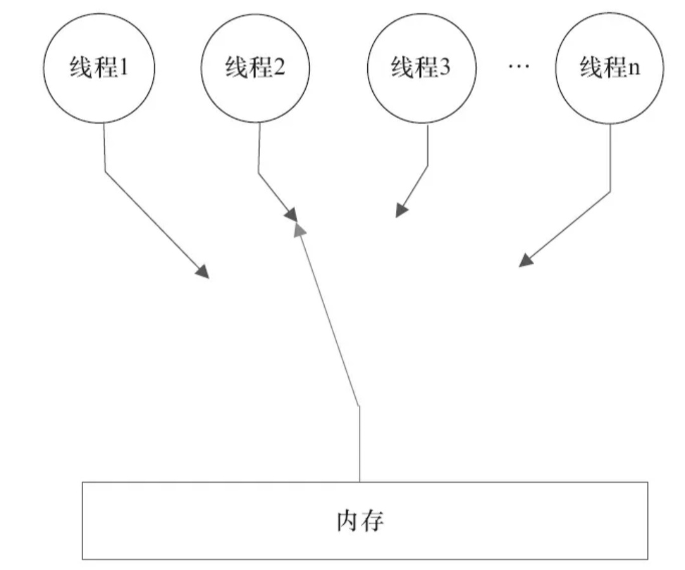

## 顺序一致性
 
顺序一致性内存模型是一个理论参考模型，在设计的时候，处理器的内存模型和编程语言的内存模型都会以顺序一致性内存模型作为参照。

### 数据竞争与数据一致性

当程序未正确同步时，就可能存在数据竞争。
 
Java内存模型规范对数据竞争的定义如下：**在一个线程中写一个变量，在另一个线程读同一个变量，而且写和读没有通过同步来排序。**

如果一个多线程程序能正确同步，这个程序将是一个没有数据竞争的程序。

JMM对正确同步的多线程程序的内存一致性做了如下保证：**如果程序是正确同步的，程序的执行将具有顺序一致性**(Sequentially Consistent —— 即**程序的执行结果与该程序在顺序一致性内存模型中的执行结果相同**。

### 顺序一致性内存模型

**顺序一致性模型是一个**被计算机科学家**理想化了的理论参考模型**，它为程序员**提供了极强的内存可见性保证**。

顺序一致性内存模型有两大特性：

- 1.**一个线程中的所有操作必须按照程序的顺序来执行**。

- 2.(不管程序是否同步)**所有线程都只能看到一个单一的操作执行顺序**。在顺序一致性内存模型中，每个操作都必须原子执行且立刻对所有线程可见。

#### 顺序一致性内存模型的视图

在概念上，顺序一致性模型有一个单一的全局内存，这个内存通过一个左右摆动的开关可以连接到任意一个线程，同时每一个线程必须按照程序的顺序来执行内存读/写操作。

在任意时间点最多只有一个线程可以连接到内存。

当多个线程并发执行时，图中的开关装置能把所有线程的所有内存读/写操作串行化（即**在顺序一致性模型中，所有操作之间具有全序关系**）。

顺序一致性模型中的每个操作必须立即对任意线程可见。

JMM中就没有这个保证。**未同步程序在JMM中不但整体的执行顺序是无序的，而且所有线程看到的操作执行顺序也可能不一致**。

- 在当前线程把写过的数据缓存在本地内存中，没有刷新到主内存之前，这个写操作仅对当前线程可见；从其他线程的角度来看，会认为这个写操作根本没有被当前线程执行。
- 只有当前线程把本地内存中写过的数据刷新到主内存之后，这个写操作才能对其他线程可见。

这种情况下，当前线程和其他线程看到底操作顺序将不一致。

### 同步程序的顺序一致性效果

**顺序一致性模型中，所有操作完全按程序的顺序串行执行**。

**JMM中，临界区内的代码可以重排序**（但JMM不允许临界区内的代码“逸出”到临界区之外，那会破坏监视器的语义）。**JMM会在退出临界区和进入临界区这两个关键时间点做一些特别处理，使得线程在这两个时间点具有与顺序一致性模型相同的内存视图**。

监视器具有互斥执行的特性。

JMM在具体实现上的基本方针为；在不改变（正确同步的）程序执行结果的前提下，尽可能的为编辑器和处理器的优化大开方便之门。

### 未同步程序的执行特性

对于未同步或为正确同步的多线程程序，JMM只提供最小安全性：线程执行时读取到的值，是之前某个线程写入的值或默认值（0，Null，False），**JMM保证线程读操作取到的值不会是无中生有的**。

为实现最小安全性，JVM在堆上分配对象时，首先会对内存空间进行清零，然后才会在上面分配对象（JVM内部会同步这两个操作）。因此，**清零的内存空间（Pre-zeroed Memory）分配对象时，域的默认初始化已经完成**。

未同步程序在JMM中的执行，整体上是无序的，其执行结果无法预知，不保证执行结果与该程序在顺序一致性模型中的执行结果一致。

未同步程序在两个模型中执行特性的几个差异：

| |顺序一致性模型 | JMM |
|---|---|---|
| 单线程内的操作会按照程序的顺序执行。| 保证 | 不保证（如临界区内的重排序） |
| 所有线程能看到一致的操作执行顺序。 | 保证 | 不保证 |
| 对所有的内存读/写操作都具有原子性。 | 保证 | JMM不保证对64位的long型和double型变量的写操作具有原子性。 |

最后一个差异**与处理器总线的工作机制**密切相关。

在计算机中，数据通过总线在处理器和内存之间传递。

每次处理器和内存之间的数据传递都是通过一系列步骤来完成的，这一系列步骤称为**总线事务**（Bus Transaction）。

总线事务包括读事务（Read Transaction）和写事务（Write Transaction）.

- 读事务从内存传递数据到处理器；
- 写事务从处理器传递数据到内存；
- 每个事务会读/写内存中一个或多个物理上连续的字。

**总线会同步试图并发使用总线的事务**。

在一个处理器执行总线事务期间，总线会禁止其他的处理器和I/O设备执行内存的读/写。

当多个处理器同时向总线发起总线事务，这时总线仲裁（Bus Arbitration）会对竞争作出裁决。

总线仲裁会确保所有处理器都能公平的访问内存。

总线的这些工作机制可以把所有处理器对内存的访问以串行化的方式来进行。**在任意时间点，最多只能有一个处理器可以访问内存**。这个特性**确保了单个总线事务之中的内存读/写操作具有原子性**。

在一些32位的处理器上，如果要求对64位数据的写操作具有原子性，会有比较大的开销。

为照顾这中处理器，Java语言规范鼓励但不强求JVM对64位的long型变量和double型变量的写操作具有原子性。

当JVM在这种处理器上运行时，**可能会把一个64位long/double型变量的写操作拆分成两个32位的写操作**来执行。**这两个32位的写操作可能会被分配到不同的总线事务中执行**，此时**对这个64位变量的写操作将不具有原子性**。

在JSR-133之前的旧内存模型中，一个64位long/double型变量的读/写操作可以被拆分成两个32位的读/写操作来执行。

从**JSR-133内存模型开始**（即JDK5开始），**仅仅只允许把一个64位long/double型变量的写操作拆分成两个32位的写操作来执行**，任意读操作在JSR-133中都必须具有原子性（即**任意读操作必须要在单个读事务中执行**）。
