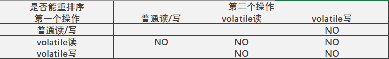
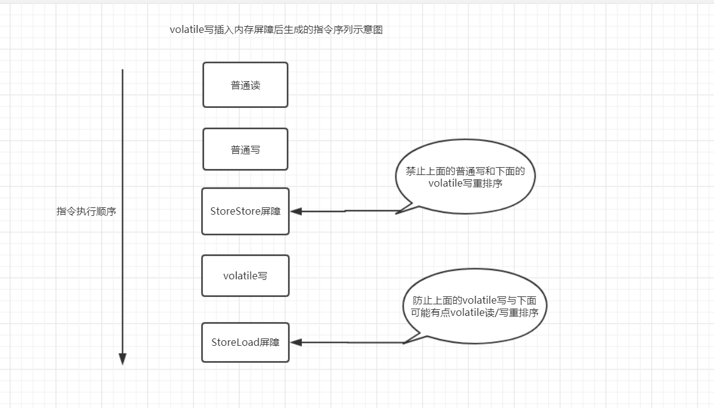
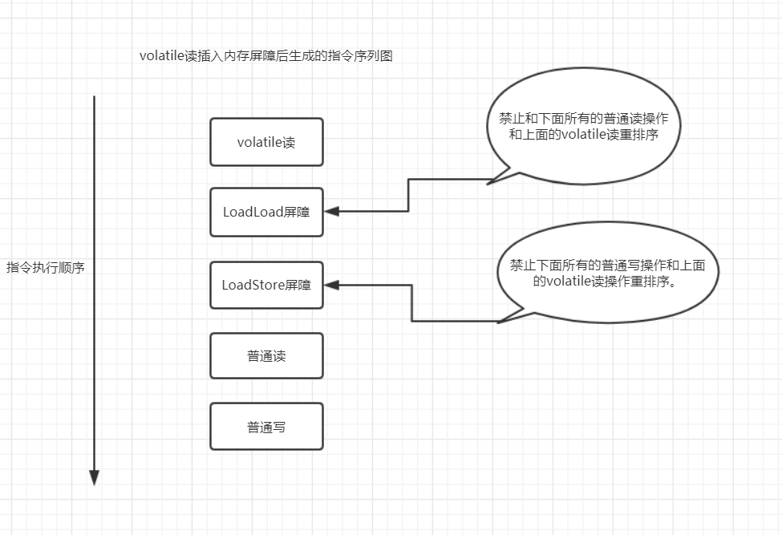
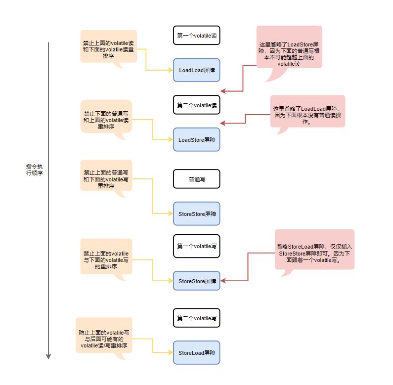

## volatile的特性

对volatile变量的单个读/写，可看成是使用同一个锁对这些单个读/写操作做了同步。如示例：

```java
class VolatileFeaturesExample {
    // 使用volatile声明64位的long型变量。
    volatile long vl = 0L;

    public void set(long l) {
        // 单个volatile变量的写
        vl = l;
    }

    public void getAndIncrement() {
        // 复合（多个）volatile变量的读/写
        vl++;
    }

    public long get() {
        // 单个volatile变量的读
        return vl;
    }
}
```
当有多个线程分别调用上面程序中的3个方法，这个程序在语义上和下面的程序等价；
```java
class VolatileFeaturesExample {
    // 64位的long型普通变量
    long vl = 0L;

    /**
    * 对单个的普通变量的写用同一个锁同步
    */
    public synchronized void set(long l){
        vl = l;
    }

    /**
    * 普通方法调用
    */
    public void getAndIncrement() {
        // 调用已同步的读方法。
        long temp = get();
        // 普通鞋操作
        temp +=1L;
        // 调用已同步的写方法
        set(temp);
    }

    /**
    * 对单个的普通变量的读用同一个锁同步
    */
    public synchronized long get() {
        return vl;
    }
}
```

由此可见，**一个volatile变量的单个读/写操作，与一个普通变量的读/写操作都是使用同一个锁来同步，它们之间的执行效果相同**。

锁的happens-before规则保证释放锁和获取锁的两个线程之间的内存可见性。

锁的语义决定了临界区代码的执行具有原子性。

简而言之，volatile变量自身具有以下特性：
- **可见性**：对一个volatile变量的读，总是能够看到（任意线程）对这个volatile变量最后的写入。
- **原子性**：对任意单个volatile变量的读/写操作具有原子性，但类似于volatile++这样的复合操作不具有原子性。

### volatile写-读建立的happens-before关系

从JSR-133开始（即JDK5开始），volatile变量的写-读可以实现线程之间的通信。

从内存语义的角度来说，volatile的写-读与锁的释放-获取有相同的内存效果：

- volatile写和锁的释放有相同的内存语义。
- volatile读与锁的获取有相同的内存语义。

下面我们通过相关示例来分析volatile写-读建立的happens-before关系：
```java
class VolatileTest {
    int i = 0;
    volatile boolean flag = false;

    // Thread A
    public void writer(){
        i = 2;               // 1   
        flage = true;       // 2
    }
    // Thread B
    public void reader() {
        if(flage) {                                         //3
            System.out.println("---windocdr.com----: " + i); // 4
        }
    }
}
```
假设线程A执行writer()方法后，线程B执行reader()方法。根据happens-before规则，上面的程序得到如下关系：

- 已久程序次序规则：1 happens-before 2；3 happens-before 4。
- 根据volatile规则：2 happens-before 3。
- 根据happens-before的传递性规则： 1 happens-before 4；

A线程在写volatile变量之前所有可见的共享变量，在B线程读取同一个volatile之后，将立即变得对B线程可见。

### volatile写-读的内存语义

volatile的内存语义如下：
- 写的内存语义：当写一个volatile变量时，JMM会把该线程对应的本地内存中的共享变量刷新到主内存。
- 读的内存语义：当读一个volatile变量时，JMM会把该线程对应的本地内存置为无效。线程接下来将从主内存中读取共享变量。

线程A写一个volatile变量，实质上是线程A向接下来将要读这个volate变量的某个线程发出了（其对共享变量所做修改的）消息。

线程B读一个volate变量，实质上是线程B接收了之前某个线程发出的（在写这个volatile变量之前对共享变量所做修改）消息。

线程A写一个volatile变量，随后线程B读取该变量，这个过程实质是线程A通过主内存向线程B发送消息。

### volatile内存语义的实现

[前文](https://windcoder.com/bingfaxuexibiji05-zhongpaixu)提到重排序分为编译器重排序和处理器重排序。为了实现volatile内存语义，JMM会分别限制这两种类型的重排序类型。以下是JMM针对编译器制定的的volatile重排序规则表：




- 当第二个操作是volatile写时，不管第一个操作是什么，都不能重排序。这个规则确保volatile写之前的操作不会被编辑器重排序到volatile写之后。
- 当第一个操作是volatile读时，不管第二个操作是什么，都不能重排序。这个规则确保volatile读之后的操作不会被编辑器重排序到volatile读之前。
- 当第一个操作是volatile写，第二个操作是volatile读时，不能重排序。

为了实现volatile的内存语义，编辑器在生成字节码时，会在指令序列中**插入内存屏障**来禁止特定类型的处理器重排序。

JMM采用保守策略。以下是基于保守策略的JMM内存屏障插入策略：

- 在每个volatile写操作的前面插入一个StoreStore屏障。
- 在每个volatile写操作的后面插入一个StoreLoad屏障。
- 在每个volatile读操作的后面插入一个LoadLoad屏障。
- 在每个volatile读操作的后面插入一个LoadStore屏障。

该策略可以保证在任意处理器平台，任意的程序中都能得到正确的volatile内存语义。

- **StoreStore屏障**将**保证上面所有的普通写在volatile写之前刷新到主内存**。

- **StoreLoad屏障**的作用是**避免volatile写与后面可能有的volatile读/写操作重排序**。

- **LoadLoad屏障**用来**禁止处理器把上面的volatile读与下面的普通读重排序**。

- **LoadStore屏障**用来**禁止处理器把上面的volatile读与下面的普通写重排序**。

volatile写插入内存屏障后生成的指令序列示意图如下：



volatile读插入内存屏障后生成的指令序列图：




从整体执行效率的角度考虑，JMM最终选择了在每个volatile写之后插入一个StoreLoad屏障，而不是volatile读之前。因为volatile写-读内存语义的常见使用模式是：一个写线程写volatile变量，多个读线程读同一个volatile变量。当读线程大大超过写线程时，选择在volatile写之后插入StoreLoad屏障将带来可观的执行效率的提升。从这里可见JMM在实现上的一个特点：**首先确保正确性，然后再去追求执行效率**。

实际执行时，只要不改变volatile的内存语义，**编译器**可以根据具体情况省略不必要的屏障。如实例：
```java
class VolatileTest {
    int a;
    volatile int v1 = 1;
    volatile int v2 = 2;

    void readAndWrite() {
        int i = v1;   // 第一个volatile读
        int j = v2;  // 第二个volatile读
        a = i+j;    // 普通写
        v1 = i+2;  // 第一个volatile写
        v2 = j*2;  // 第二个volatile写
    }
    ...... // 其他方法
}
```
中的readAndWrite()方法，编译器生成字节码时可以做如下优化：





由于不同的处理器有不同的“松紧度”的处理器内存模型，**内存屏障的插入还可以根据具体的处理器内存模型继续优化**。如：

X86处理器仅会对写-读操作做重排序，不会对读-读，读-写和写-写操作做重排序。因此会省略这3中操作类型对应的内存屏障，JMM仅需在volatile写后面插入一个StoreLoad屏障即可正确实现volatile写-读的内存语义。

这意味着X86处理器中，volatile写的开销比volatile读的开销大很多，因为执行StoreLoad屏障的开销会比较大。


### JSR-133增强volatile的内存语义

在JSR-133之前的旧Java内存模型中，虽然不运允许volatile变量之间重排序，但旧的Java内存模型允许volatile变量和普通变量重排序。
因此，在旧的内存模型中，volatile写-读没有锁的释放-获取所具有的内存语义。

为了提供一种比锁更轻量级的线程之间通信的机制，133专家组决定增强其内存语义：严格限制编译器和处理器对volatile变量与普通变量的重排序，确保volatile写-读和锁的释放-获取具有相同的内存语义。

从编译器重排序规则和处理器内存屏障插入策略来看，只要volatile变量与普通变量之间的重排序可能会破坏volatile的内存语义，这种重排序就会被编译器重排序规则和处理器内存屏障插入策略禁止。

由于volatile仅仅保证对单个volatile变量的读/写具有原子性，而锁的互斥执行的特性可以确保对整个临界区代码的执行具有原子性。

- 功能上，锁比volatile更强大；
- 在可伸缩性和执行性能上，volatile更胜一筹；

想在在程序中使用volatile代替锁时请一定要慎重。

