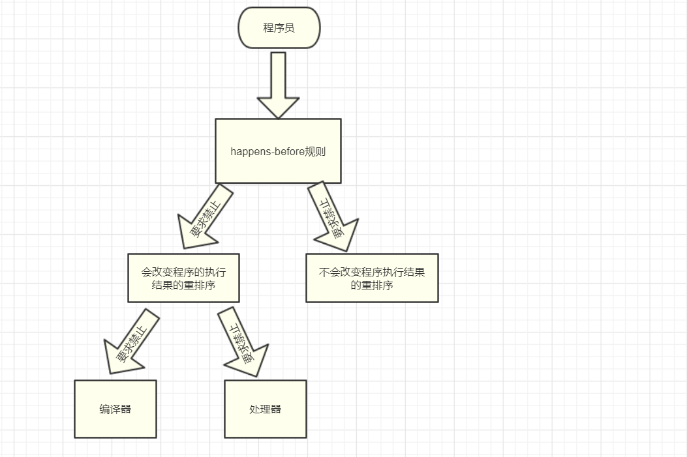

JMM把happens-before要求禁止的重排序分为下面两类：
- 会改变程序执行结果的重排序；
- 不会改变程序执行结果的重排序。

JMM对这两种不同性质的重排序采取了如下不同的策略：
- 对于会改变程序执行结果的重排序，JMm要求编译器和处理器必须禁止这种重排序。
- 对于不会改变程序执行结果的重排序，JMM对编译器和处理器不做要求（即允许这种）。

**happens-before关系的定义**如下：
- 如果一个操作happens-before另一个操作，那么第一个操作的执行结果将对第二个操作可见，而第一个操作的执行顺序排在第二个操作之前。
- 两个操作之间存在happens-before关系，并不意味着Java平台的具体实现必须要按照happens-before关系指定的顺序来执行。如果重排序之后的执行结果，与按happens-before关系来执行的结果一致，那么这种重排序并不非法（即允许这种重排序）。

1是JMM对程序员的承诺，2是JMM对编译器和处理器重排序的约束规则。happens-before关系本质上和as-if-serial语义是一回事：

| |as-if-serial|happens-before|
|---| --- | --- |
| 保证 | 单线程内程序的执行结果不被改变。| 正确同步的多线程程序的执行结果不被改变。 |
| 幻境 | 单线程程序是按程序的顺序来执行的。 | 正确同步的多线程程序是按照happens-before指定的顺序来执行的。 |

## happens-before规则
- **程序顺序规则**：一个线程中的每个操作，happens-before于该线程中的任意后续操作。
- **监视器锁规则**：对一个锁的解锁，happens-before于随后对这个锁的加锁。
- **volatile变量规则**：对一个volatile域的写，happens-before于任意后续对这个volatile域的读。
- **传递性**：如果A happens-before B，且B happens-before C，那么A happens-before C。
- **start()规则**：如果线程A执行操作ThreadB.start()（启动线程B），那么A线程的THreadB.start()操作happens-before于线程B中的任意操作。
- **join()规则**：如果线程A执行操作ThreadB.join()并成功返回，那么线程B中的任意操作happens-before于线程A从ThreadB.join()操作成功返回。

start()规则意味着**线程A在执行ThreadB.start()之前对共享变量所做的修改，接下来在B线程开始执行后都将确保对线程B可见**。

join()规则意味着**线程A执行操作ThreadB.join()并成功返回后，线程B中的任意操作都将对线程A可见**。