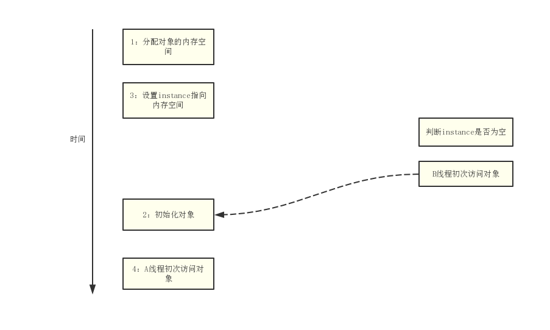
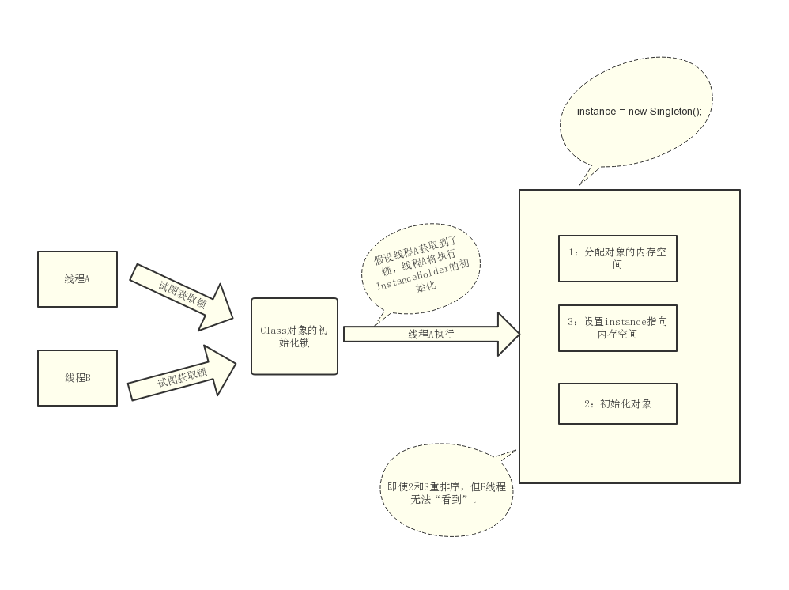

关于双重检测锁定，了解过单例的应该不陌生，但也容易写错。这里以单例模式为例一起探索。

## 问题分析

首先看一下基本的懒汉模式
```java
public class Singleton {
    private static Singleton instance;

    private Singleton(){}

    public static Singleton getInstance() {
        if(instance==null) {                // 1：A线程执行
            instance = new Singleton();    // 2：B线程执行
        }
        return instance;
    }
}
```
我们都知晓这种方式不是线程安全的，在多线程吓不能正常工作：当A线程执行代码1的同时，B线程执行代码2.此时，A线程可能会看到instance引用的对象还未初始化。

对此，我们可以对getInstance（）方法做同步处理来实现线程安全的延迟初始化，其优化如下：
```java
public class Singleton {
    private static Singleton instance;

    private Singleton(){}

    public synchronized static Singleton getInstance() {
        if(instance==null) {
            instance = new Singleton();
        }
        return instance;
    }
}
```

由于对getInstance()方法做了同步处理，synchronize将导致性能开销。如果getInstance()方法被多个线程频繁的调用，将会导致程序执行性能的下降。

在早期JMM中，synchronized(甚至是无竞争的synchronized)存在巨大性能问题。为了继续优化，因此人们想出了**一个“聪明”的技巧**，即双重检查锁定（Double-Checked Locking，简称DCL）：
```java
public class Singleton {                       // 1
    private static Singleton instance;         // 2
    private Singleton(){}

    public static Signleton getInstance() {   // 3
        if(instance == null) {               // 4：第一次检查
            synchronized(Singleton.class) {  // 5：加锁
                if(instance == null) {       // 6：第二次检查
                    instrance = new Singleton(); // 7：问题根源
                }                            
            }                                // 8
        }                                    // 9                    
        return instance;                   // 10     
    }                                      // 11 
}
```
上面的看起来两全其美：
- 多个线程试图在同一时间创建对象时，会通过加锁来保证只有一个线程能创建对象。
- 在对象创建后，执行getInstance()方法将不需要获取锁，直接返回已创建好的对象。

### 问题根源

虽然看起来完美，但是一个错误的优化。在线程执行到第4行，代码读取到instance不为null时，instance引用的对象可能还没初始化完成。下面看一下具体根源。
实例化一个对象（如第7行的```instrance=new Singleton();```）要分三个步骤：
- 1.分配对象的内存空间。
- 2.初始化对象。
- 3.设置instance指向（即将内存空间分配给对应的引用）

但由于重排序，2和3可能发生重排序（在一些JIT编译器上，这种重排序是真实发生的），其过程如下：
- 1.分配对象的内存空间。
- 3.设置instance指向（即将内存空间分配给对应的引用）---注意：此时对象还未被初始化。
- 2.初始化对象。 

所有线程在执行Java程序时必须要遵守intra-thread semantics。intra-thread semantics保证重排序不会改变单线程内的程序执行结果。

上面的2、3的重排序在没改变单线程程序的执行结果的前提下，可以提高程序的执行性能，故并未违反intra-thread semantics。然A线程正常执行时，B线程将看到一个还没被初始化的对象：B线程会导致第二个判断出错，instance != null，但它获得的仅是一个地址，此时A线程还未初始化，故B线程返回的instance对象是一个没有初始化的对象，如图：



知晓问题根源后，可以想到两个办法来解决：
- 1.不允许2和3重排序。
- 2.允许2和3重排序，但不允许其他线程“看到”这个重排序。

## 解决方案

### 基于volatile的解决方案

对于上面基于DCL方案只需做一点小的修改即可，亦既把instance声明为volatile型：
```java
public class Singleton {                   
    private volatile static Singleton instance; 
    private Singleton(){}

    public static Signleton getInstance() { 
        if(instance == null) {            
            synchronized(Singleton.class) { 
                if(instance == null) {     
                    instrance = new Singleton(); 
                }                            
            }                               
        }                                                      
        return instance;                      
    }                                      
}
```
当instance声明为volatile后，步骤2、3的重排序在多线程环境中将会被禁止，从而解决问题。该解决方案需要JDK5及以上。

### 基于类初始化的解决方案

JVM在类的初始化阶段（即在Class被加载后，且被线程使用之前），会执行类的初始化。在此期间，JVM会获取一个锁。这个锁可以同步多个线程对同一个类的初始化。

基于该特性，可以实现另一种线程安全的延迟初始化方案，该方案被称之为Initialization On Demand Holder idiom:
```java
public class Singleton { 
    private static class InstanceHolder {
        public static Singleton instance = new Singleton();
    }
    private Singleton(){}

    public static Signleton getInstance() {                                               
        return InstanceHolder.instance; // 这里将导致 InstanceHolder类被初始化                     
    }                                      
}
```
该方案的解决是指是：允许2和3重排序，但不允许非构造线程（此处指B线程）“看到”这个重排序。执行示意图如下：



初始化一个类，包括执行这个类的静态初始化和初始化在这个类中声明的静态自动。根据Java语言规范，在首次发生下列任意一种情况时，一个类或接口类型T将被立即初始化：

- 1.T是一个类，而且一个T类型的实例被创建。
- 2.T是一个类，且T中声明的一个静态方法被调用。
- 3.T中声明的一个静态字段被赋值。
- 4.T中声明的一个静态字段被使用，而且这个字段不是一个常量字段。
- 5.T是一个顶级类（Top Level Class），而且一个断言语句嵌套在T内部被执行。

在Singleton中，首次执行getInstance()方法的线程将导致InstanceHolder类被初始化（符合情况4）。

- Java语言规定，对于每个类或者接口C，都有一个唯一的初始化锁LC与之对应。
- 从C到LC的映射，由JVM的具体实现去自由实现。
- JVM在类初始化期间会获取这个初始化锁，并且每个线程至少获取一次锁来保证这个类已经被初始化过了。

