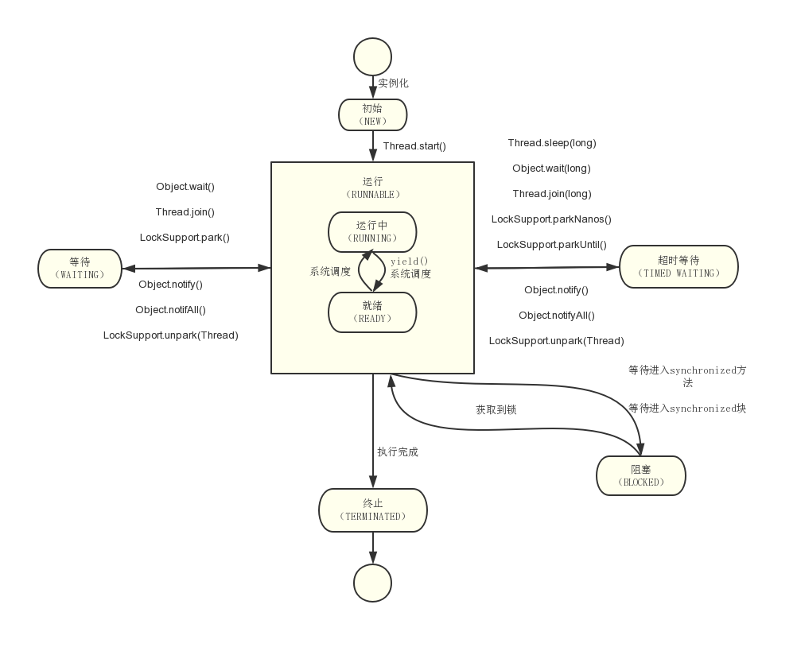

## 线程简介
### 什么是线程

现代操作系统在运行一个程序时，会为其创建一个进程。

进程就是运行在它自己的地址空间内的自包容的程序。

现代操作系统调度的最小单元是线程，也叫轻量级进程（Light Weight Process）。

在一个进程里可以创建多个线程，这些线程都拥有各自的计数器、堆栈和局部变量等属性，并且能够访问共享的内存变量。处理器在这些线程上高速切换，让使用者感觉到这些线程在同时执行。

可使用JMX(ThreadMXBeen)查看java程序包含哪些线程。

线程是大多数操作系统调度的基本单元，一个程序作为一个进程来运行，程序运行过程中可以创建多个线程，而一个线程在一个时刻只能运行在一个处理器核心上。
使用多线程的原因主要有以下几点：
- 更多的处理器核心
- 更快的响应时间
- 更好的编程模型

### 线程优先级
现代操作系统基本采用时分的形式调度运行的线程，操作系统会分出一个个时间片，线程会分配到若干时间片，当线程的时间片用完了就会发生线程调度，并等待着下次分配。线程分配到的时间片多少也就决定了线程使用处理器资源的多少，而线程优先级就是决定线程需要多还是少分配一些处理器资源的线程属性。

在Java线程中，通过一个整形成员变量priority来控制优先级，优先级的范围从1~10。在线程构建的时候可以通过setPriority(int)方法来修改优先级，默认优先级为5。

- 优先级高的线程分配时间片的数量要多于优先级低的线程。
- 设置线程优先级时，中针对频繁阻塞（休眠或者I/O操作）的线程需要设置较高的优先级。
- 偏重计算（需要较多CPU时间或者偏运算）的线程则设置较低的优先级，确保线程不会被独占。
- 线程优先级不能作为程序正确性的依赖，因为操作系统可以完全不用理会Java线程对于优先级的设定。

### 线程的状态

Java线程在运行的生命周期中可能处于6中不同状态，在给定的一个时刻，线程只能处于其中一个状态：

| 状态名称 | 说明 |
| --- | --- |
| NEW | 初始状态，线程被构建，但是还没调用start()方法。|
| RUNNABLE | 运行状态，Java线程将操作系统中的就绪和运行两种状态笼统地称作“运行中”。|
| BLOCKED | 阻塞状态，表示线程阻塞于锁。 |
| WAITING | 等待状态，表示线程进入等待状态，进入该状态表示当前线程需要等待其他线程做出一些特定动作（通知或中断）。|
| TIME_WAITING | 超时等待状态，该状态不同于WAITING，它是可以在指定的时间自行返回的。|
| TERMINATED | 终止状态，表示当前线程已经执行完毕。|

其关系如图：

- 线程创建之后，调用start()方法开始运行。
- 当线程执行wait()方法之后，线程进入等待状态。
- 进入等待状态的线程需要依靠其他线程的通知才能返回到运行状态，而超时等待状态相当于在等待状态的基础上增加了超时限制，即到达超时时间时返回到运行状态。
- 当线程调用同步方法时，在没有获得到锁的情况下将进入阻塞状态。
- 线程在执行Runnable的run()方法之后将会进入到终止状态。

Java将操作系统中的运行和就绪两个状态合并称为运行状态。
阻塞状态是线程阻塞在进入synchronized关键字修饰的方法或代码块（获取锁）时的状态，但是阻塞在java.concurrent包中Lock接口的线程状态却是等待状态，因为java.concurrent包中Lock接口对于阻塞的实现均实现了LockSupport类中的相关代码。

### Daemon线程

Daemon线程是一种支持型线程，因为它主要被用作程序中后台调度以及支持性工作。当一个Java虚拟机中不存在非Daemon线程时，虚拟机将会退出。可通过Thread.setDaemon(true)将线程设置为Daemon线程，且需在启动前调用。

Java虚拟机退出时Daemon线程中的finally块不一定会执行，意味着不能依靠finally块中的内容来确保执行关闭或清理资源的逻辑。

## 启动和终止线程

### 构造线程
在运行之前首先要构造一个线程对象，线程对象在构造的时候需要提供线程所需要的属性，如线程所需要的线程组、线程优先级、是否为Daemon线程等信息。

一个新构造的线程对象是由其parent线程来进行空间分配的，而child线程继承了parent是否为Daemon、优先级和加载资源的contextClassLoader以及可继承的ThreadLocal，同时还会分配一个唯一ID来标识这个child线程。至此一个能够运行的线程对象就初始化好了，在堆中等待运行。

### 启动线程
线程对象初始化完之后调用start()方法即可启动该线程。start()方法的含义是：**当前线程（即parent线程）同步告知虚拟机，只要线程规划器空闲，就应当立即启动调用start()方法的线程**。

启动一个线程前最好为该线程设置线程名称，这样在使用jstack分析系统或进行问题排查时得到一些提示。

### 理解中断
中断可以理解为：**线程的一个标识位属性，它表示一个运行中的线程是否被其他线程进行了中断操作**。其他线程通过调用该线程的interrupt()方法对其进行中断操作。

线程通过检测自身是否被中断来进行响应，通过方法isInterrupted()来进行判断是否被中断，也可以调用静态方法Thread.interrupted()对当前线程的中断标识位进行复位。中断状态初始时为 false，正常状态下，线程一旦被中断,该方法返回true。

如果该线程已经处于终结状态，即使线程被中断，在调用该线程对象的isInterrupted()时依旧返回false。

声明抛出InterruptedException的方法在抛出该异常之前，Java虚拟机会先将该线程的中断标识位清除，然后抛出InterruptedException，此时调用isInterrupted()时返回false。

### 过期的suspend()、resume()和stop()
线程Thread的暂停、恢复和停止操作的API分别是suspend()、resume()和stop()。但已经不建议使用，原因如下：
以suspend()的方法为例，在调用后，线程不会释放已经占有的资源（比如锁），而是占有着资源进入睡眠状态，这样容易引发死锁问题。同样，stop()方法在终结一个线程时不会保证线程的资源正常释放，通常是没有给予线程完成资源释放工作的机会，因此导致程序可能工作在不确定的状态下。

暂停和恢复操作可以用等待/通知机制来代替。

### 安全地终止线程

中断状态是线程的一个标识位，中断操作是一种简便的线程间交互方式，而这种交互方式最适合用来取消或停止任务。除了中断以为，还可以利用一个boolean变量来控制是否需要停止任务并终止该线程。

这种通过标识位或者终断操作的方式能够能够使线程在终止时有机会去清理资源，而不是武断得将线程停止，因此这种终止线程的做法显得更加安全和优雅。

