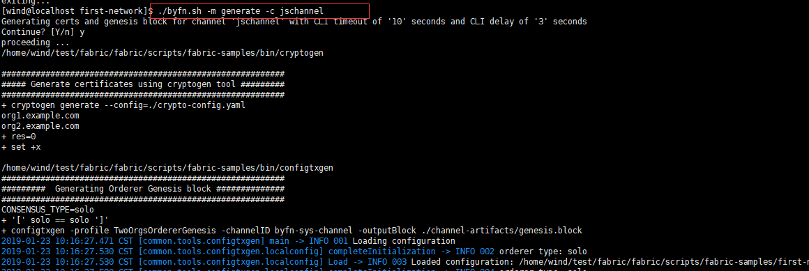
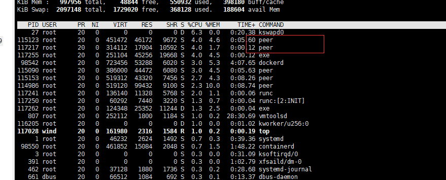
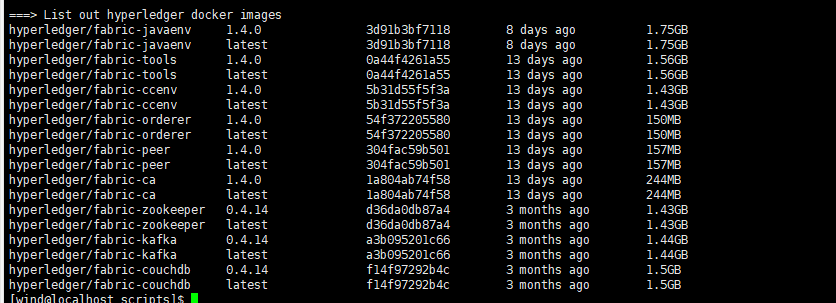

```shell
sudo yum install screen -y
screen -S fabric
git clone https://github.com/hyperledger/fabric.git
git clone https://github.com/hyperledger/fabric-samples.git
```


### 生成配置
```
./byfn.sh -m generate -c jschannel
```


### 启动网络

```
./byfn.sh -m up -c jschannel
```

```
screen -S fabric
screen -ls
screen -r fabric
```
[inux screen 命令详解](https://www.cnblogs.com/cute/p/5015852.html)

[centos7安装配置Hyperledger fabric1.4.0](https://blog.csdn.net/asn_forever/article/details/86505376)

[安装Fabric示例](http://chixiang.me/2018/07/13/%E5%AE%89%E8%A3%85Fabric%E7%A4%BA%E4%BE%8B/#more)

```
# 测试
curl -sSL https://bit.ly/2ysbOFE | bash -s -- 1.4.0
```

### 错误

```
[wind@localhost first-network]$ ./byfn.sh -m up -c jschannel
Starting for channel 'jschannel' with CLI timeout of '10' seconds and CLI delay of '3' seconds
Continue? [Y/n] y
proceeding ...
LOCAL_VERSION=1.4.0
DOCKER_IMAGE_VERSION=1.4.0
./byfn.sh:行169: docker-compose: 未找到命令
ERROR !!!! Unable to start network
```


https://github.com/docker/compose/releases

[CentOS7 - Docker&Docker-Compose安装](https://blog.csdn.net/qq_38591756/article/details/82828130#%E4%B8%89%E3%80%81Docker%20Compose%E5%AE%89%E8%A3%85)

github-production-release-asset-2e65be.s3.amazonaws.com


## 
```shell
curl -L https://github.com/docker/compose/releases/download/1.24.0-rc1/docker-compose-`uname -s`-`uname -m` -o /usr/local/bin/docker-compose
chmod +x /usr/local/bin/docker-compose
```
----------------------------------------------------------------

## 1. 系统环境

- VMware 12
- CentOS-7-x86_64-Minimal-1804

本文是在VMware的CentOS7安装测试的。
## 2. 基础环境
- Go  1.11.4 :
- Docker : 参考 [Get Docker CE for CentOS](https://docs.docker.com/install/linux/docker-ce/centos/)
- Docker-Compose :
## 3. 安装

### 3.1 使用screen创建新的命令终端
该步骤为可选项，仅是为了能方便恢复会话运行。
```
screen -S fabric
```
如果提示screen: command not found 命令不存在可以执行：```yum install screen``` 或 ```apt-get install screen```安装。

如果网络掉线，可以重新连接SSH，再执行 ```screen -r fabric``` 就会看到你的lnmp安装进程。

有时候screen异常退出可能会提示状态为Attached，可以执行：```screen -D -r fabric``` 进行恢复。

有时候可能会创建了多个同名的screen会话，可以执行：```screen -ls``` 查看对应会话的session id.

### 3.2 下载源码
```
git clone https://github.com/hyperledger/fabric.git
```
### 3.3 拉取镜像

进入fabric/scripts目录，执行bootstrap.sh脚本,将会自动获取所需镜像，耗时可能略长，期间出现异常或连接超时等，可重新执行。如果开始时执行过screen命令，也不用担心中途关闭窗口导致中断或记录消失的情况。
```
./bootstrap.sh
```


### 3.4 构建网络BYFN(build your first network)
进入fabric/scripts/fabric-samples/first-network/目录，执行

### 生成配置

```
./byfn.sh -m generate -c jschannel
```
该命令会根据 crypto-config.yaml 配置文件生成初始化配置。


### 启动网络

```
./byfn.sh -m up -c jschannel
```

通过top命令可看到peer等节点已经启动。
