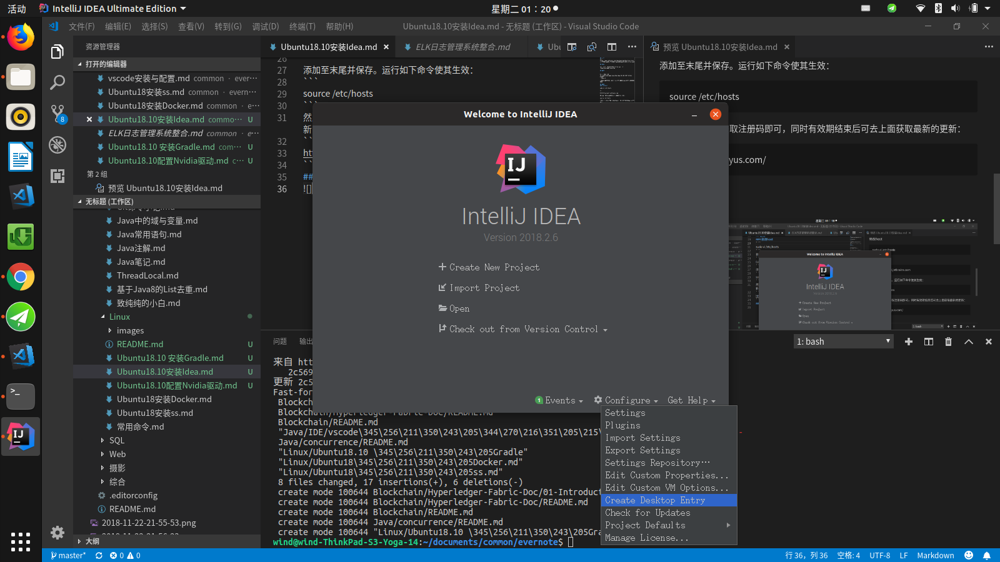

## 下载
前往https://www.jetbrains.com/idea/download/#section=linux 下载对应版本。这里用的Ultimate的ideaIU-2018.2.6.tar.gz。

## 解压
```
tar -zxvf  ideaIU-2018.2.6.tar.gz  -C  /home/wind/apps/Java/Ide
```
## 启动

```
# 进入解压目录
cd /home/wind/apps/Java/Ide/idea-IU-182.5107.16/bin
# 启动
./idea.sh
```
这样直接启动需要注册激活，下面说破解之法，当然有能力的推荐直接购买。

## 破解
### 修改host
```
sudo vi /etc/hosts
```
将
```
0.0.0.0 account.jetbrains.com
```
添加至末尾并保存。运行如下命令使其生效：
```
source /etc/hosts
```
然后去如下地址获取注册码即可，同时有效期结束后可去上面获取最新的更新：
```
http://idea.lanyus.com/
```
## 创建快捷键
成功启动后，可通过Configure->Create desktop entry生成我们需要的快捷键，如图：
