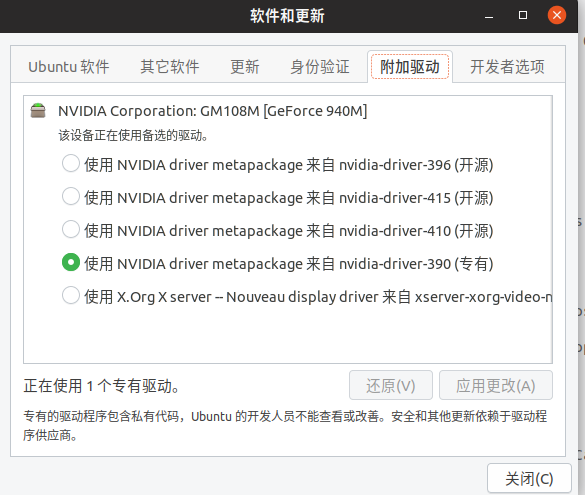

## 检测推荐版本
```
sudo ubuntu-drivers devices
```
得到带有recommended标记的：
```
driver   : nvidia-driver-390- third-party free recommended
```
可以先选择自动选择安装
```
sudo ubuntu-drivers autoinstall
```
若是还有问题可以再使用如下安装：
```
sudo add-apt-repository ppa:graphics-drivers/ppa
sudo apt-get update
sudo apt-get install nvidia-390
```
一般这样就可以了，此时“软件和更新”-》“附加驱动”中就会出现已安装的所有，选一个合适的即可，比如：
