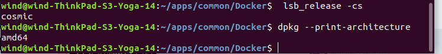

## 设置Docker存储库

```
# 更新apt包索引：

sudo apt-get update

# 安装包以允许apt通过HTTPS使用存储库：

sudo apt-get install \
    apt-transport-https \
    ca-certificates \
    curl \
    software-properties-common

# 添加Docker的官方GPG密钥：

curl -fsSL https://download.docker.com/linux/ubuntu/gpg | sudo apt-key add -

# 9DC8 5822 9FC7 DD38 854A E2D8 8D81 803C 0EBF CD88通过搜索指纹的最后8个字符，验证现在拥有带指纹的密钥 

sudo apt-key fingerprint 0EBFCD88

```


获取Ubuntu发行版的名称
```
lsb_release -cs
```
获得
```
cosmic
```

查看本机的系统架构
```
amd64
```


执行使用以下命令设置稳定存储库：
```
sudo add-apt-repository \
   "deb [arch=amd64] https://download.docker.com/linux/ubuntu \
   cosmic\
   stable"
```

发现18.10的稳定版暂时没有，故改用的18.04的：
```
sudo add-apt-repository  "deb [arch=amd64] https://download.docker.com/linux/ubuntu  bionic  stable"
```
## 安装DOCKER CE
```
# 更新apt包索引。
sudo apt-get update

# 安装最新版本的Docker CE
sudo apt-get install docker-ce

```

[获取Ubuntu的Docker CE](https://docs.docker.com/install/linux/docker-ce/ubuntu/#prerequisites)


[Get Docker CE for CentOS](https://docs.docker.com/install/linux/docker-ce/centos/)

https://hyperledger-fabric.readthedocs.io/en/latest/install.html
