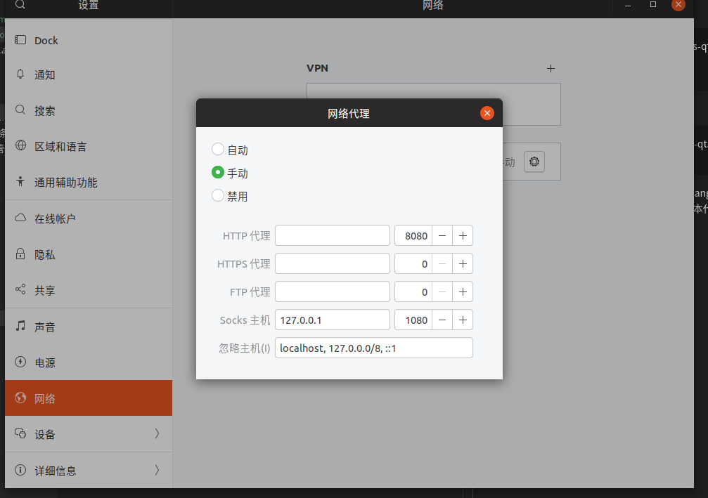

## 安装

```
sudo add-apt-repository ppa:hzwhuang/ss-qt5
sudo apt-get update
sudo apt-get install shadowsocks-qt5 
```

运行第一步后可能会出现类似如下错误：
```
“http://ppa.launchpad.net/hzwhuang/ss-qt5/ubuntu cosmic Release” 没有 Release 文件 的错误。
```

这时，只要编辑/etc/apt/sources.list.d/hzwhuang-ubuntu-ss-qt5-cosmic.list 文件，将cosmic (18.10版本代号)改成xenial（16.04版本代号）。

## 配置
系统设置->网络->网络代理，设置手动，配置如下，端口号是个人ss中配置的本地端口，如下图：



这样当开启ss时才能正常访问，不然ss即使显示已连接依旧是无效的。