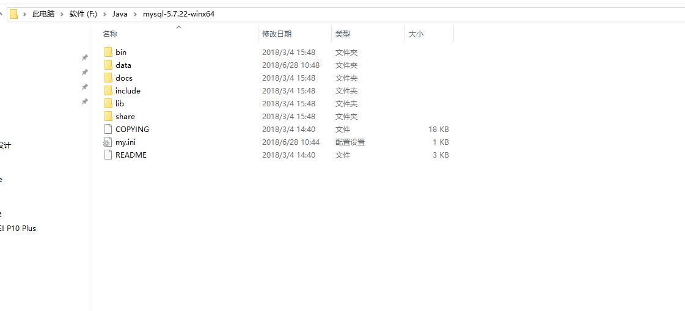
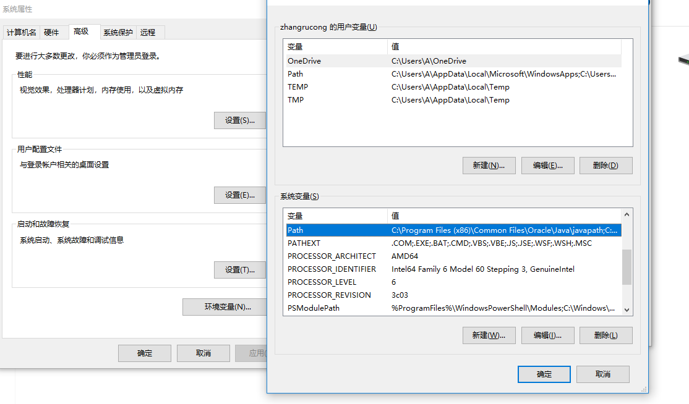
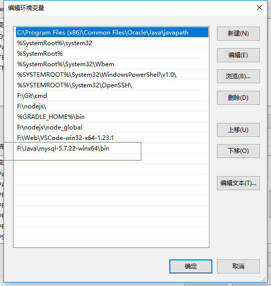

## 下载压缩包

## 解压到指定位置
本文以 ```F:\Java\mysql-5.7.22-winx64```为例。现在初始不再有配置文件my.ini，需要自己新建，具体方式见下一步。


## 新建my.ini
新建文件my.ini,内容暂且如下：
```
[mysql]  
# 设置mysql客户端默认字符集  
default-character-set=utf8  
[mysqld]  
#设置3306端口  
port = 3306  
# 设置mysql的安装目录  
basedir=F:\Java\mysql-5.7.22-winx64 
# 设置mysql数据库的数据的存放目录  
datadir=F:\Java\mysql-5.7.22-winx64\data  
# 允许最大连接数  
max_connections=200  
# 服务端使用的字符集默认为8比特编码的latin1字符集  
character-set-server=utf8
# 创建新表时将使用的默认存储引擎  
default-storage-engine=INNODB
```
## 配置环境变量

依次操作：计算机–右键–属性–高级系统设置–环境变量



选中Path编辑，,在其后面添加: 你的mysql 安装文件下面的bin文件夹 
(如: F:\Java\mysql-5.7.22-winx64\bin )

