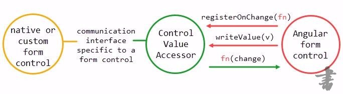
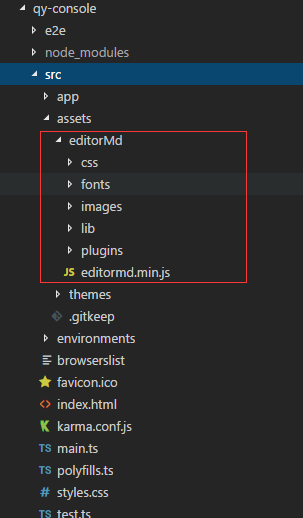

曾经找到过“Editor.md”，看之心喜，一直想在Angular中集成下这款markdownpad编辑器玩，在网上也只找到一篇[通过指令集成](Angular集成Editor.md的Markdown编辑器，支持NgModel双向绑定)的，虽然可以实现，但还是希望能做成组件形式的，之后看到一篇自定义组件的文章，了解到ControlValueAccessor才真正完成这个心愿，现在记录分享与诸公。

## ControlValueAccessor
这是自定义表单组件的核心，只有继承这个接口，才有被 Angular的formControl识别的资格。

ControlValueAccessor要处理的就是实现 Model -> View，View -> Model 之间的数据绑定，其具体的作用是：

- 把 form 模型中值映射到视图中
- 当视图发生变化时，通知 form directives 或 form controls

该接口具体如下，已去掉其中的英文注释：
```
export interface ControlValueAccessor {

    writeValue(obj: any): void;
    
    registerOnChange(fn: any): void;
  
    registerOnTouched(fn: any): void;
   
    setDisabledState?(isDisabled: boolean): void;
}
```

- writeValue是在初始化的时候将formControl的值传递给原生表单控件（即，将模型中的新值写入视图或 DOM 属性中）；
- registerOnChange用来获取原生表单控件的值更新时通知Angular表单控件更新的函数（即，设置当控件接收到 change 事件后，调用的函数）
- registerOnTouched用来获取通知用户正在交互的函数（即，设置当控件接收到 touched 事件后，调用的函数）。
- setDisabledState?(isDisabled: boolean)：设置DISABLED状态时做的执行的方法。即，当控件状态变成 DISABLED 或从 DISABLED 状态变化成 ENABLE 状态时，会调用该函数。该函数会根据参数值，启用或禁用指定的 DOM 元素。



明确来说，那些原生表单控件都有其对应的ControlValueAccessor，比如：
- DefaultValueAccessor - 用于 text 和 textarea 类型的输入控件
- SelectControlValueAccessor - 用于 select 选择控件
- CheckboxControlValueAccessor - 用于 checkbox 复选控件

至于原生表单控件和Angular表单控件能够保持一致的原理，可以看下formControl指令的实现：
```
// https://github.com/angular/angular/blob/master/packages/forms/src/directives/reactive_directives/form_control_directive.ts
export class FormControlDirective extends NgControl implements OnChanges {
...
  ngOnChanges(changes: SimpleChanges): void {
                if (this._isControlChanged(changes)) {
                  setUpControl(this.form, this);
                  if (this.control.disabled && this.valueAccessor !.setDisabledState) {
                    this.valueAccessor !.setDisabledState !(true);
                  }
                  this.form.updateValueAndValidity({emitEvent: false});
                }
                if (isPropertyUpdated(changes, this.viewModel)) {
                  _ngModelWarning(
                      'formControl', FormControlDirective, this, this._ngModelWarningConfig);
                  this.form.setValue(this.model);
                  this.viewModel = this.model;
                }
              }
...
}
```
这里仅列出了部分实现，formControl指令调用了setUpControl函数来实现formControl和ControlValueAccessor之间的交互。
```
// https://github.com/angular/angular/blob/master/packages/forms/src/directives/shared.ts
...

dir.valueAccessor !.writeValue(control.value);

...

function setUpViewChangePipeline(control: FormControl, dir: NgControl): void {
  dir.valueAccessor !.registerOnChange((newValue: any) => {
    control._pendingValue = newValue;
    control._pendingChange = true;
    control._pendingDirty = true;

    if (control.updateOn === 'change') updateControl(control, dir);
  });
}

...

function setUpModelChangePipeline(control: FormControl, dir: NgControl): void {
  control.registerOnChange((newValue: any, emitModelEvent: boolean) => {
    // control -> view
    dir.valueAccessor !.writeValue(newValue);

    // control -> ngModel
    if (emitModelEvent) dir.viewToModelUpdate(newValue);
  });
}

...

function setUpModelChangePipeline(control: FormControl, dir: NgControl): void {
  control.registerOnChange((newValue: any, emitModelEvent: boolean) => {
    // control -> view
    dir.valueAccessor !.writeValue(newValue);

    // control -> ngModel
    if (emitModelEvent) dir.viewToModelUpdate(newValue);
  });
}

...

```
里面确实能看到一些似曾相识的方法，但个人能力有限，无法完全看懂，也就只能到这里了，喜欢深入探究的可以自行探索。

## 准备工作

经过上面大致了解ControlValueAccessor，在正式开始前还需要最后的准备工作：

1.使用npm或者yarn安装jquery
```
npm install jquery
或者
yarn add jquery
```
2.[下载Editor.md](http://pandao.github.io/editor.md/)
3.将需要的css、fonts、images、lib、plugins三个文件夹和editormd.min.js文件放入assets中（其他位置也可，记得配置第3步中对应的angular.json），这里添加的是精简资源，也可以把解压出来的全部放进去，效果如图：

4.配置angular.json
```
"styles": [
              "src/assets/editorMd/css/editormd.min.css",
              "node_modules/ng-zorro-antd/src/ng-zorro-antd.min.css",
              "src/styles.css"
            ],
            "scripts": [
              "node_modules/jquery/dist/jquery.min.js",
              "src/assets/editorMd/editormd.min.js"
            ]
```
## 创建EditorMdComponent
该组件肯定要继承ControlValueAccessor，首先是实现其上面的方法。
### writeValue
```
  writeValue(value: string): void {
    this.value = value;
    if (this.mdeditor) {
        this.mdeditor.setMarkdown(this.value);
    }
  }
```
### registerOnChange
```
  onChange: Function = () => { };
  registerOnChange(fn: any): void {
    this.onChange = fn;
  }
```
### registerOnTouched
本示例中实际未用的该方法，主要是registerOnChange。
```
  onTouched: Function = () => { };
    registerOnTouched(fn: any): void {
    this.onTouched = fn;
  }
```
### setDisabledState
这个也未使用，即便设置也会报mdeditor未知的错误，禁用功能需要使用其他方式解决。
```
  setDisabledState?(isDisabled: boolean): void {
    if (isDisabled) {
      this.mdeditor.setDisabled();
    } else {
        this.mdeditor.setEnabled();
    }
  }
```
### AfterViewInit
我们需要执行初始化编辑器的操作，故实现了AfterViewInit。
```
  ngAfterViewInit(): void {
    this.init();
  }
  
   init() {
		if (typeof editormd === 'undefined') {
		  console.error('UEditor is missing');
		  return;
		}
		this.editormdConfig = this.editormdConfig != null ? this.editormdConfig : new EditorConfig();
		this.editormdConfig.onload = () => {
		  if (this.value) {
			this.mdeditor.setMarkdown(this.value);
		  }
		};
		this.editormdConfig.onchange = () => {
		  this.updateValue(this.mdeditor.getMarkdown());
		};


		this.mdeditor = editormd(this.host.nativeElement.id, this.editormdConfig); // 创建编辑器

  }
  
  
updateValue(value: string) {
    this.ngZone.run(() => {
        this.value = value;
        this.onChange(this.value); // 关键代码
        this.onTouched();

        this.onValueChange.emit(this.value);
        this.getHtmlValue.emit({ originalEvent: event, value: this.getHtmlContent() });
    });
 }
```
### OnDestroy
为了安全周期，实现了OnDestroy
```
  ngOnDestroy(): void {
    this.destroy();
  }
  
 destroy() {
	  if (this.mdeditor) {
		  this.mdeditor.removeListener('ready');
		  this.mdeditor.removeListener('contentChange');
		  this.mdeditor.editor.remove();
		  this.mdeditor.destroy();
		  this.mdeditor = null;
	  }
}
```
