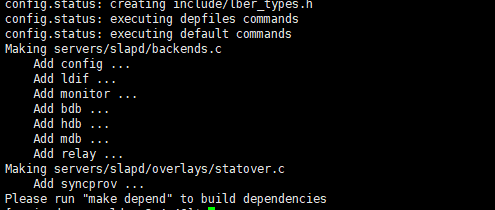
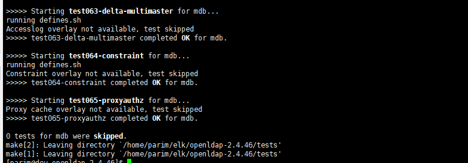

## 准备
```
# 下载
wget http://gpl.savoirfairelinux.net/pub/mirrors/openldap/openldap-release/openldap-2.4.46.tgz

# 解压
gunzip -c openldap-2.4.46.tgz | tar xvfB -

# 检测系统环境
./configure

```

	
## 构建软件
```
# 先构建依赖关系
make depend

# 再编译软件
make

# 检测构建--这一步等待时间略长
make test

```


## 安装
```
// 安装软件
su root -c 'make install'
```
## 配置

### 设置加密的密码

```
slappasswd
```
根据提示输入两遍密码，即可获得加密后端密码，如：
```
{SSHA}LFvNxLuy20L00BudQ8MYgv8ZdxRSXNxd
```


### 修改 slapd.conf

```
// 进入
cd /usr/local/etc/openldap/

sudo vi slapd.conf
```

根据需求导入schema，此处需要inetorgperson，故添加如下：
```
include        /usr/local/etc/openldap/schema/cosine.schema
include        /usr/local/etc/openldap/schema/inetorgperson.schema
```
修改suffix、rootdn、rootpw、directory，这些均可改成自己的：
```
suffix		"dc=windcoder,dc=com"
# 账号
rootdn     "cn=admin,dc=windcoder,dc=com"
# 密码，即上面生成的
rootpw     {SSHA}LFvNxLuy20L00BudQ8MYgv8ZdxRSXNxd
# 可以看做数据存储位置，自定义即可。
directory	/usr/local/etc/openldap/datas/openldap-data
```
此处的directory目录，不会自动创建，需手动创建，不然会造成无法启动，暂时不知其他目录下是否会自动创建。

## 启动
```
sudo /usr/local/libexec/slapd
```
查看启动状态：
```
ps -ef |grep slapd
```

## 导入数据

### 创建文件
```
sudo vi test1.ldif
```
添加：

```
dn: dc=windcoder,dc=com
objectClass: top
objectClass: dcObject
objectClass: organization
dc: windcoder
o: windcoder-com


dn: ou=User,dc=windcoder,dc=com
objectclass: top
objectclass: person
objectclass: organizationalPerson
sn:Person
cn:Some-Person
```
添加entry时，如果父级目录不存在，也通常会返回“ldap_add: No such object (32)”的错误。故这里在第一次导入时（类似初始化），优先创建根目录。

### 导入

```
ldapadd -x -D "cn=admin,dc=windcoder,dc=com" -W -f test1.ldif
```
输入Ldap登录密码（即rootpw被加密之前的原始密码）后出现类似如下提示而不报错即可：

```
adding new entry "dc=windcoder,dc=com"

adding new entry "ou=User,dc=windcoder,dc=com"
```
### 查看
```
ldapsearch -x -b 'dc=windcoder,dc=com' '(objectClass=*)'
```
输出：
```
# extended LDIF
#
# LDAPv3
# base <dc=windcoder,dc=com> with scope subtree
# filter: (objectClass=*)
# requesting: ALL
#

# windcoder.com
dn: dc=windcoder,dc=com
objectClass: top
objectClass: dcObject
objectClass: organization
dc: windcoder
o: windcoder-com

# User,  windcoder.com
dn: ou=User,dc=windcoder,dc=com
objectClass: top
objectClass: person
objectClass: organizationalPerson
sn: Person
cn: Some-Person
ou: User
```

## 放行端口
ldap默认389，ldaps默认636 。此处以开放389为例。
### iptables篇

```
         /sbin/iptables -I INPUT -p tcp --dport 389 -j ACCEPT   // 写入修改
 
         /etc/init.d/iptables save   // 保存修改
 
        service iptables restart    // 重启防火墙，修改生效
```
### firewall篇

```
sudo firewall-cmd --zone=public --add-port=389/tcp --permanent
sudo firewall-cmd --reload
```