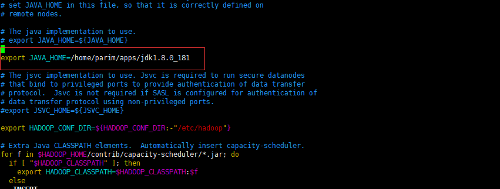
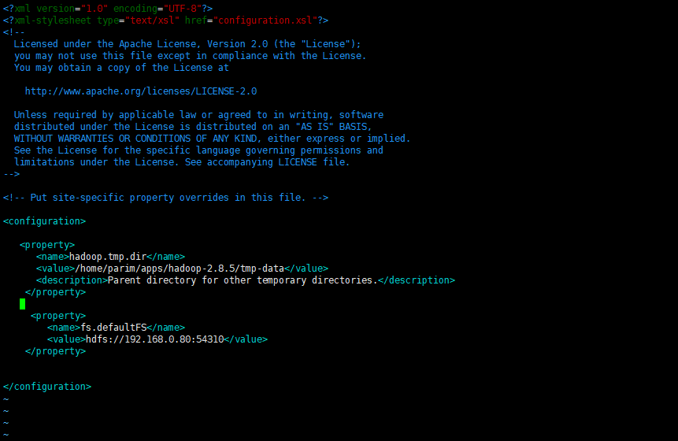
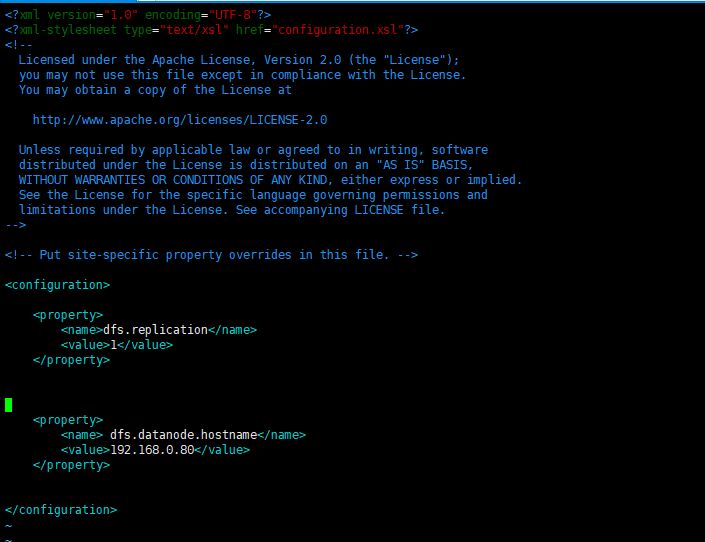
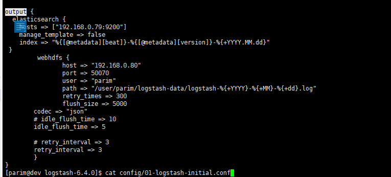
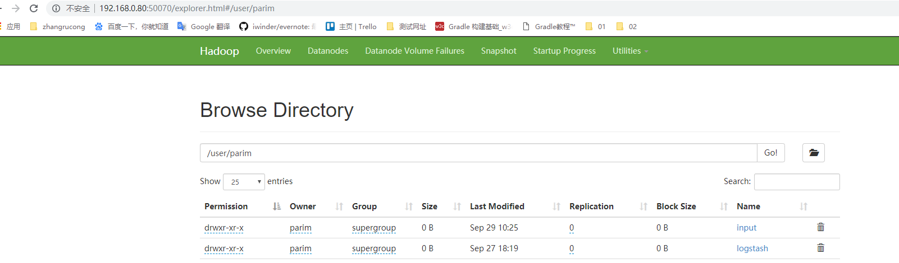

## 前提
本文是之前elk的后续，故默认已搭建好logstash等elk相关环境。侧重点是Hadoop安装以及其与logstash的Output插件的整合。

假设存在两台服务器并处于同一局域网中，分别是192.168.0.79和192.168.0.80，系统均是CentOS7，且均已安装Java 8。
- ELK系统已部署在192.168.0.79
- Hadoop将部署于192.168.0.80

原则Hadoop集群需要ssh免密登陆配置，以便操作节点的启动与停止，这里暂不涉及此方面需求，故舍去。相关的可在 [官方文档-Hadoop: Setting up a Single Node Cluster.](https://hadoop.apache.org/docs/r2.8.5/hadoop-project-dist/hadoop-common/SingleCluster.html) 查看。

## 下载并解压Hadoop 
可从官方[ Apache Download Mirrors](http://www.apache.org/dyn/closer.cgi/hadoop/common/)获取链接下载。本文下载的为Hadoop-2.8.5：
```
wget http://mirrors.hust.edu.cn/apache/hadoop/common/hadoop-2.8.5/hadoop-2.8.5.tar.gz
```
完成后解压文件：

```
tar -zxvf hadoop-2.8.5.tar.gz
```
得到hadoop-2.8.5文件夹

## 配置
进入解压后的hadoop-2.8.5文件夹：
```
cd hadoop-2.8.5
```
### etc/hadoop/hadoop-env.sh

编辑etc/hadoop/hadoop-env.sh配置一些默认项，这里主要是设置 JAVA_HOME，即填写完整的 Java 安装路径。
```
vi etc/hadoop/hadoop-env.sh
```
注释掉原来的
```
# export JAVA_HOME=${JAVA_HOME}
```
192.168.0.80的Java安装目录为/home/parim/apps/jdk1.8.0_181，故添加：
```
export JAVA_HOME=/home/parim/apps/jdk1.8.0_181
```


若是需要搭建Local (Standalone) Mode，通过如下命令启动即可：
```
bin/hadoop
```
本文需要搭建Pseudo-Distributed Operation，故需要继续配置其他文件。
### etc/hadoop/core-site.xml
该文件中有两个参数需要设置：
1. fs.defaultFS - 默认文件系统的名称，端口号可自定义
2. hadoop.tmp.dir - 其他临时目录的根目录
打开core-site.xml文件：
```
vi etc/hadoop/core-site.xml
```
拷贝以下所有行的内容放入到标签 ```<configuration></configuration>``` 中间。
```
<property>
	<name>fs.defaultFS</name>
	<value>hdfs://192.168.0.80:54310</value>
</property>

<property>
  <name>hadoop.tmp.dir</name>
  <value>/home/parim/apps/hadoop-2.8.5/tmp-data</value>
  <description>Parent directory for other temporary directories.</description>
</property>
```

#### fs.defaultFS
默认文件系统的名称，本身是一个URL，其方案和权限决定了FileSystem的实现。
- 此URL的方案（scheme ）确定命名FileSystem 实现类的配置属性（fs.SCHEME.impl）。
- 此URL的权限（authority ）用于确定文件系统的主机，端口等。
- ```fs.defaultFS```是旧版本fs.default.name的代替，在新版中```fs.default.name```已被弃用。
参考[core-default.xml#fs.defaultFS](https://hadoop.apache.org/docs/r2.8.5/hadoop-project-dist/hadoop-common/core-default.xml#fs.defaultFS)

#### hadoop.tmp.dir

hadoop.tmp.dir的目录默认指向的是：/tmp/hadoop-${USERNAME}

这样会有个问题，系统重启时会自动删除/tmp目录下的文件，导致你之前对hadoop做的很多

操作都被删除了，需要重新再来，比如你想hdfs导入的文件会都被删除。

参考：
1. [Hadoop安装](https://www.yiibai.com/hadoop/how_to_install_hadoop.html)
2. [hadoop修改hadoop.tmp.dir](https://blog.csdn.net/sunrising_hill/article/details/50526858)

### etc/hadoop/hdfs-site.xml
这里有两个参数需要配置：
1. dfs.replication - 默认备份（块复制,block replication）。创建文件时可以指定实际的备份数。如果未在创建时指定备份，则使用默认值。[hdfs-default.xml#dfs.replication](https://hadoop.apache.org/docs/r2.8.5/hadoop-project-dist/hadoop-hdfs/hdfs-default.xml#dfs.replication)
2. dfs.datanode.hostname - datanode默认的hostname，这个不是必须的，因为这里是两台服务器之间传递信息，所以需要配置，否则会导致后面的读写操作异常。

打开hdfs-site.xml文件：
```
vi etc/hadoop/hdfs-site.xml
```
拷贝以下所有行的内容放入到标签 ```<configuration></configuration>``` 中间。
```
    <property>
        <name>dfs.replication</name>
        <value>1</value>
    </property>

    <property>
        <name> dfs.datanode.hostname</name>
        <value>192.168.0.80</value>
    </property>

```

## 启动单节点伪分布式集群
以下为在本地运行一个MapReduce job的实现，由于不是必须运行在YARN上，故暂且没配置与启动YARN。
### 格式化HDFS 
在第一使用 Hadoop 之前，需要先格式化 HDFS，使用下面的命令
```
bin/hdfs namenode -format
```
若有需要选择的，输入按提示Y即可。

### 启动单节点集群
使用以下命令启动cHadoop 的单节点集群(使用对应的用户来启动)，如下：
```
sbin/start-dfs.sh
```
若该用户之前设置了免密登录，此处可免去多次输入密码的操作，反之则需要根据提示多次输入登录密码。

**检测运行**

可以使用 'jps' 工具/命令, 验证是否所有 Hadoop 相关的进程正在运行。
```
/home/parim//apps/jdk1.8.0_181/bin/jps
```
如果 Hadoop 成功启动，那么 jps 输出应显示： NameNode, SecondaryNameNode, DataNode.

### 访问
可通过web访问NameNode，默认链接如下：
```
 http://localhost:50070/
```
### 创建HDFS目录
创建执行 MapReduce jobs所需要的HDFS目录：
```
 bin/hdfs dfs -mkdir /user
 # bin/hdfs dfs -mkdir /user/<username>,username即启动Hadoop的用户名，这里假设为parim
 bin/hdfs dfs -mkdir /user/parim
```
### 测试
1. 将Hadoop的logs文件夹中的文件复制到分布式文件系统中：
```
bin/hdfs dfs -put logs logstash
```
默认会在HDFS中的/user/parim下创建logstash文件夹并向其写入logs中的文件，若未执行上面创建目录操作，会报无法找到/user/parim的错误。

2. 查看分布式文件系统上logstash中的文件：
```
 bin/hdfs dfs -cat logstash/*
```

## 停止/关闭 Hadoop
当需要停止时可执行如下命令
```
sbin/stop-dfs.sh
```
如果用户不是ssh免密码登录，此时需要再多次输入登录密码

## Logstash输出到Hadoop
上面是Hadoop安装到操作的基本流程，接下来转到192.168.0.79配置Logstash到Hadoop的输出。

Logstash6的Output plugins有webhdfs，其作用是使用webhdfs REST API将Logstash事件发送到HDFS。

默认Logstash启动配置文件为01-logstash-initial.conf，进入Logstash安装目录并打开文件：
```
vi config/01-logstash-initial.conf
```
在output部分追加如下内容：
```
webhdfs {
	# hdfs的namenode地址
	host => "192.168.0.80"  
	# Hadoop的webhdfs使用的端口
	port => 50070     
    # hadoop运行的用户，以这个用户的权限去写入hdfs    
	user => "parim"
	# 按年月日建log文件
	path => "/user/parim/logstash-data/logstash-%{+YYYY}-%{+MM}-%{+dd}.log"
	codec => "json"
	flush_size => 5000
	idle_flush_time => 5
	retry_interval => 3
}
```
保存后，重启Logstash即可。



#### 放行端口
为了Logstash与Hadoop通信， 192.168.0.80的Hadoop默认配置下，需要放行端口50070和50075，此处是基于firewall防火墙下的命令：
```
sudo firewall-cmd --zone=public --add-port=50070/tcp --permanent
sudo firewall-cmd --zone=public --add-port=50075/tcp --permanent
sudo firewall-cmd --reload
```

访问```http://192.168.0.80:50070```可见如下，当看到logstash-data文件夹时，说明整合成功：



进入logstash-data下载里面的log文件，打开可见类似记录：
```
{"source":"/home/parim/apps/nginx-1.10/logs/access.log","@version":"1","learner_type":"exam","tags":["beats_input_codec_plain_applied"],"type":"logs","offset":1656526468,"beat":{"version":"6.4.0","hostname":"dev.windcoder.com","name":"dev.windcoder.com"},"@timestamp":"2018-09-29T01:45:53.093Z","input":{"type":"log"},"prospector":{"type":"log"},"read_timestamp":"2018-09-29T01:45:53.093Z","nginx":{"access":{"client_ip":"192.168.0.221","method":"GET","body_sent":{"bytes":"0"},"referer":"http://sd.windcoder.com/learner/course/detail/1423705","x_forwarded":"121.69.9.234","msec":"[1538185552.664]","user_name":"-","cookie_sid":"-","time_iso8601":"2018-09-29T09:45:52+08:00","url":"/api/learner/exam/myExam/examList","user_agent":"Mozilla/5.0 (Windows NT 6.1; WOW64) AppleWebKit/537.36 (KHTML, like Gecko) Chrome/62.0.3202.62 Safari/537.36","http_version":"1.0","response_code":"302"}},"host":{"name":"dev.windcoder.com"}}
```


## 报错与解决方案
###  Hadoop获得的日志记录与预期不符
最开始Logstash中没设置```codec```，获得的记录是这样的：
```
2018-09-28T08:39:22.294Z {name=dev.windcoder.com} %{message}
```
之后设置
```
codec => plain {
                  format => "%{message}"
 }
```
又变成了
```
%{message}
```
最后设置
```
codec => "json"
```
得到了所需要的上面所示的格式。

原因就是Logstash 的Filter插件部分已将非结构化的数据进行了结构化操作，在输出时需要通过codec解码成相应的格式，对于这里就是json.

### Maybe you should increase retry_interval or reduce number of workers

#### 问题
```
[2018-09-28T15:57:43,341][WARN ][logstash.outputs.webhdfs ] webhdfs write caused an exception: {"RemoteException":{"exception":"RecoveryInProgressException","javaClassName":"org.apache.hadoop.hdfs.protocol.RecoveryInProgressException","message":"Failed to APPEND_FILE /user/parim/logstash-data/logstash-2018-09-28.log for DFSClient_NONMAPREDUCE_965601342_27 on 192.168.0.80 because lease recovery is in progress. Try again later.\n\tat org.apache.hadoop.hdfs.server.namenode.FSNamesystem.recoverLeaseInternal(FSNamesystem.java:2443)\n\tat org.apache.hadoop.hdfs.server.namenode.FSDirAppendOp.appendFile(FSDirAppendOp.java:117)\n\tat org.apache.hadoop.hdfs.server.namenode.FSNamesystem.appendFile(FSNamesystem.java:2498)\n\tat org.apache.hadoop.hdfs.server.namenode.NameNodeRpcServer.append(NameNodeRpcServer.java:759)\n\tat org.apache.hadoop.hdfs.protocolPB.ClientNamenodeProtocolServerSideTranslatorPB.append(ClientNamenodeProtocolServerSideTranslatorPB.java:437)\n\tat org.apache.hadoop.hdfs.protocol.proto.ClientNamenodeProtocolProtos$ClientNamenodeProtocol$2.callBlockingMethod(ClientNamenodeProtocolProtos.java)\n\tat org.apache.hadoop.ipc.ProtobufRpcEngine$Server$ProtoBufRpcInvoker.call(ProtobufRpcEngine.java:447)\n\tat org.apache.hadoop.ipc.RPC$Server.call(RPC.java:989)\n\tat org.apache.hadoop.ipc.Server$RpcCall.run(Server.java:850)\n\tat org.apache.hadoop.ipc.Server$RpcCall.run(Server.java:793)\n\tat java.security.AccessController.doPrivileged(Native Method)\n\tat javax.security.auth.Subject.doAs(Subject.java:422)\n\tat org.apache.hadoop.security.UserGroupInformation.doAs(UserGroupInformation.java:1844)\n\tat org.apache.hadoop.ipc.Server$Handler.run(Server.java:2489)\n"}}. Maybe you should increase retry_interval or reduce number of workers. Retrying...
```

#### 原因

HDFS的读写模式为 "write-once-read-many"，为了实现write-once，需要设计一种互斥机制，租约(Lease)应运而生

租约本质上是一个有时间约束的锁，即：在一定时间内对租约持有者（也就是客户端）赋予一定的权限。

这里的警告说Lease正在被另一个进程释放中，需要等会再试。这样就说明可能是我们Logstash写入HDFS的频率过快，导致HDFS来不及释放Lease。而且最开始Logstash中的webhdfs用的均是默认配置：

#### 解决方案
在Logstash中的webhdfs中添加配置，做输出优化：
```
	flush_size => 5000
	idle_flush_time => 5
	retry_interval => 3
```

配置项含义：

- flush_size : 如果event计数超出flush_size设置的值，即使未达到store_interval_in_secs，也会将数据发送到webhdfs，默认是500
- idle_flush_time : 以x秒为间隔将数据发送到webhdfs，默认是1
- retry_interval : 两次重试之间等待多长时间，默认是0.5

优化思路：
- 提高flush_size的值，来减少访问webhdfs的频率，同时提高HDFS的写入量
- 降低idle_flush_time的值，因为提高了flush_size，所以可以适当的减少数据发送到webhdfs的时间间隔
- 提高retry_interval的值，来减少高频重试带来的额外负载

参考:[Logstash学习（七）Logstash的webhdfs插件](https://birdben.github.io/2017/02/07/Logstash/Logstash%E5%AD%A6%E4%B9%A0%EF%BC%88%E4%B8%83%EF%BC%89Logstash%E7%9A%84webhdfs%E6%8F%92%E4%BB%B6/)

[ Webhdfs output plugin](https://www.elastic.co/guide/en/logstash/6.4/plugins-outputs-webhdfs.html#plugins-outputs-webhdfs-options)
## Hadoop与Java版本
| Hadoop | Java |
| --- | --- |
| 2.7及以后版本 | Java 7 + |
| 2.6及以前版本 | Java 6 +|
[HadoopJavaVersions](https://wiki.apache.org/hadoop/HadoopJavaVersions)

