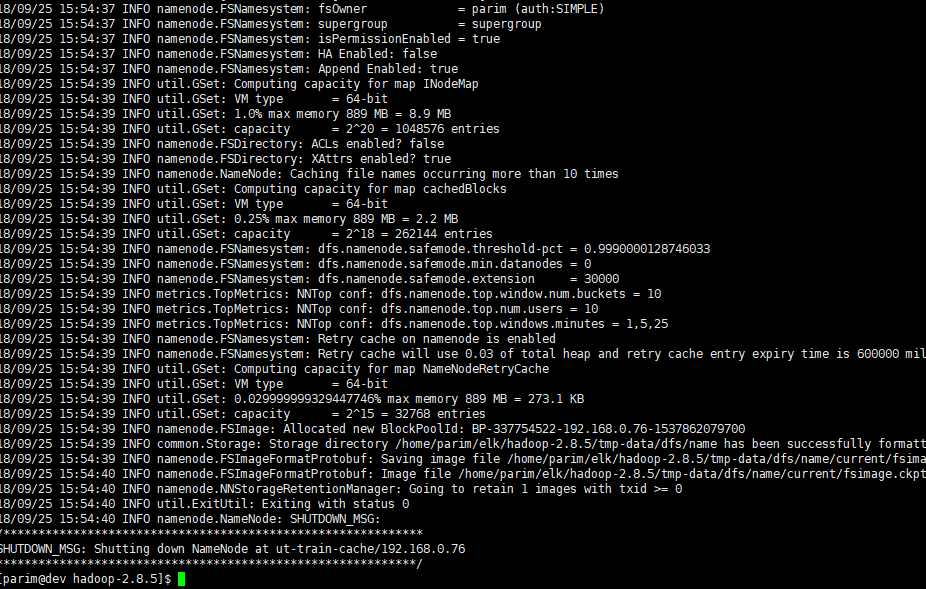
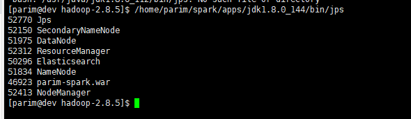
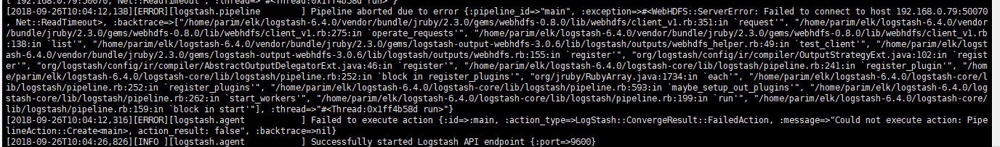

## 下载并解压
```
wget http://mirrors.hust.edu.cn/apache/hadoop/common/hadoop-2.8.5/hadoop-2.8.5.tar.gz
tar -zxvf hadoop-2.8.5.tar.gz
```

## 指定Java版本

在解压的Hadoop目录下， 编辑etc/hadoop/hadoop-env.sh文件

```
export JAVA_HOME=/home/parim/spark/apps/jdk1.8.0_144/
```
## 执行
### core-site.xml
在 $HADOOP_HOME/etc/hadoop/core-site.xml 文件中还有两个参数需要设置：


1. 'hadoop.tmp.dir' - 用于指定目录让 Hadoop 来存储其数据文件。

2. 'fs.default.name' - 指定默认的文件系统


为了设置两个参数，打开文件 core-site.xml，更改为：
```
<configuration>
    <property>
      <name>hadoop.tmp.dir</name>
      <value>/home/parim/elk/hadoop-2.8.5/tmp-data</value>
      <description>Parent directory for other temporary directories.</description>
    </property>
     <property>
        <name>fs.defaultFS</name>
        <value>hdfs://localhost:54310</value>
    </property>
</configuration>
```

hadoop.tmp.dir是hadoop文件系统依赖的基础配置，很多路径都依赖它。它默认的位置是在/tmp/{$user}下面，但是在/tmp路径下的存储是不安全的，因为linux一次重启，文件就可能被删除。

### hdfs-site.xml:
etc/hadoop/hdfs-site.xml:
```
<configuration>
    <property>
        <name>dfs.replication</name>
        <value>1</value>
    </property>
</configuration>

```
这里配置的类似备份数。
[HDFS的dfs.replication不同验证](https://www.cnblogs.com/felixzh/p/8258313.html)


### 格式化

在第一次使用 Hadoop 之前，需要先格式化 HDFS：
```
 bin/hdfs namenode -format
```
结果如下：



### 启动 Hadoop 的单节点集群
 启动NameNode守护程序和DataNode守护程序
```
$HADOOP_HOME/sbin/start-dfs.sh
```


### 检测是否正则运行
```
/home/parim/spark/apps/jdk1.8.0_144/bin/jps
```


如果 Hadoop 成功启动，那么 jps 输出应显示： NameNode, NodeManager, ResourceManager, SecondaryNameNode, DataNode.


### 停止
```
 $HADOOP_HOME/sbin/stop-dfs.sh
```
## 

```
$HADOOP_HOME/sbin/start-yarn.sh
```


配置logstash


```
        webhdfs {
                workers => 2
                host => "192.168.0.79"  # namenode节点
                port => "5070"          # webhdfs端口
                user => "parim"           #以这个用户的权限去写hdfs
                path => "/home/parim/elk/hadoop-2.8.5/logstash-data/logstash-%{+YYYY}-%{+MM}-%{+dd}.log"     # 按天创建log
                codec => "json"
        }
```


```
Pipeline aborted due to error {:pipeline_id=>"main", :exception=>#<WebHDFS::ServerError: Failed to connect to host 192.168.0.79:50070, Net::ReadTimeout>, :backtrace=>["/home/parim/elk/logstash-6.4.0/vendor/bundle/jruby/2.3.0/gems/webhdfs-0.8.0/lib/webhdfs/client_v1.rb:351:in `request'", "/home/parim/elk/logstash-6.4.0/vendor/bundle/jruby/2.3.0/gems/webhdfs-0.8.0/lib/webhdfs/client_v1.rb:275:in `operate_requests'", "/home/parim/elk/logstash-6.4.0/vendor/bundle/jruby/2.3.0/gems/webhdfs-0.8.0/lib/webhdfs/client_v1.rb:138:in `list'", "/home/parim/elk/logstash-6.4.0/vendor/bundle/jruby/2.3.0/gems/logstash-output-webhdfs-3.0.6/lib/logstash/outputs/webhdfs_helper.rb:49:in `test_client'", "/home/parim/elk/logstash-6.4.0/vendor/bundle/jruby/2.3.0/gems/logstash-output-webhdfs-3.0.6/lib/logstash/outputs/webhdfs.rb:155:in `register'", "org/logstash/config/ir/compiler/OutputStrategyExt.java:102:in `register'", "org/logstash/config/ir/compiler/AbstractOutputDelegatorExt.java:46:in `register'", "/home/parim/elk/logstash-6.4.0/logstash-core/lib/logstash/pipeline.rb:241:in `register_plugin'", "/home/parim/elk/logstash-6.4.0/logstash-core/lib/logstash/pipeline.rb:252:in `block in register_plugins'", "org/jruby/RubyArray.java:1734:in `each'", "/home/parim/elk/logstash-6.4.0/logstash-core/lib/logstash/pipeline.rb:252:in `register_plugins'", "/home/parim/elk/logstash-6.4.0/logstash-core/lib/logstash/pipeline.rb:593:in `maybe_setup_out_plugins'", "/home/parim/elk/logstash-6.4.0/logstash-core/lib/logstash/pipeline.rb:262:in `start_workers'", "/home/parim/elk/logstash-6.4.0/logstash-core/lib/logstash/pipeline.rb:199:in `run'", "/home/parim/elk/logstash-6.4.0/logstash-core/lib/logstash/pipeline.rb:159:in `block in start'"], :thread=>"#<Thread:0x1ff4b58d run>"}
[2018-09-26T10:04:12,316][ERROR][logstash.agent           ] Failed to execute action {:id=>:main, :action_type=>LogStash::ConvergeResult::FailedAction, :message=>"Could not execute action: PipelineAction::Create<main>, action_result: false", :backtrace=>nil}

```



[bash: hdfs: command not found](https://blog.csdn.net/a295277302/article/details/72861845)

[Logstash使用webhdfs插件遇到写入HDFS权限问题](https://blog.csdn.net/weixin_40163498/article/details/80413216)