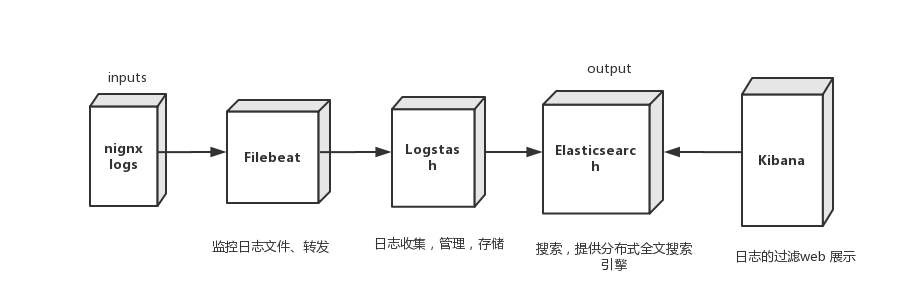

## 简介

Filebeat轻量级的日志传输工具，可以读取系统、nignx、apache等logs文件，监控日志文件，传输数据到Elasticsearch或者Logstash，最后在Kibana中实现可视化。

在这里要实现的功能为：
1. Filebeat从nignx读取日志文件，将过滤后的数据传给Logstash。
2. Logstash收集到Filebeat传来的数据后格式化输出到 Elasticsearch。
3. 最后再由Kibana 访问Elasticsearch提供的比较友好的 Web 界面进行汇总、分析、搜索。

## 准备工作
### 基础环境检查
```
cat /etc/hosts
127.0.0.1   localhost localhost.localdomain localhost4 localhost4.localdomain4
::1       localhost localhost.localdomain localhost6 localhost6.localdomain6

192.168.0.76	ut-train-cache mongodb

192.168.0.76	dev.qc.net db-master

192.168.0.79	sk.qc.net
```
