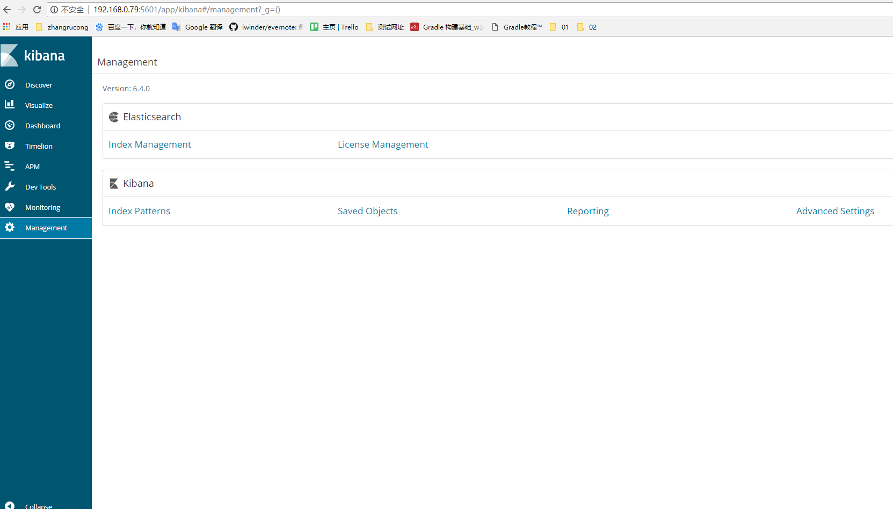
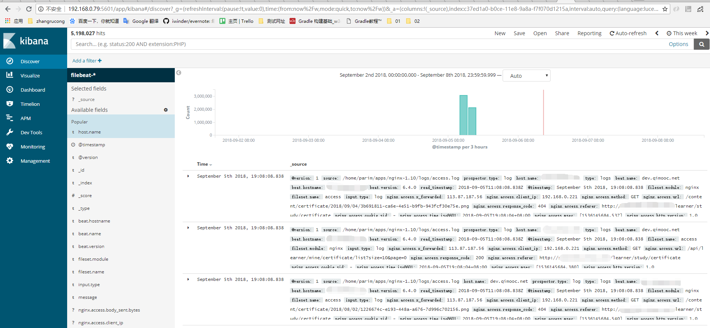
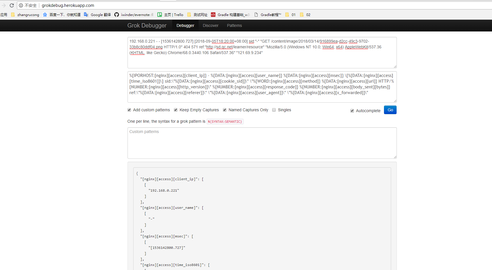

## 1.简介

Filebeat轻量级的日志传输工具，可以读取系统、nignx、apache等logs文件，监控日志文件，传输数据到Elasticsearch或者Logstash，最后在Kibana中实现可视化。

在这里要实现的功能为：
1. Filebeat从nignx读取日志文件，将过滤后的数据传给Logstash。
2. Logstash收集到Filebeat传来的数据后格式化输出到 Elasticsearch。
3. 最后再由Kibana 访问Elasticsearch提供的比较友好的 Web 界面进行汇总、分析、搜索。

## 2.准备工作
### 2.1 基础环境检查
```

[parim@dev ~]# cat /etc/hosts

127.0.0.1   localhost localhost.localdomain localhost4 localhost4.localdomain4
::1       localhost localhost.localdomain localhost6 localhost6.localdomain6

192.168.0.76	ut-train-cache mongodb

192.168.0.76	dev.qc.net db-master

192.168.0.79	sk.qc.net

```
### 2.2 软件包
wget获取所需软件包，这里默认nignx以安装配置。最新的软件包可从[官网](https://www.elastic.co/cn/downloads) 下载。这里使用的tar.gz压缩格式的安装包。

```

[parim@dev ~]# mkdir elk
[parim@dev ~]# cd elk/
[parim@dev elk]# wget https://artifacts.elastic.co/downloads/elasticsearch/elasticsearch-6.4.0.tar.gz
[parim@dev elk]# wget https://artifacts.elastic.co/downloads/logstash/logstash-6.4.0.tar.gz
[parim@dev elk]# wget https://artifacts.elastic.co/downloads/kibana/kibana-6.4.0-linux-x86_64.tar.gz
[parim@dev elk]# wget https://artifacts.elastic.co/downloads/beats/filebeat/filebeat-6.4.0-linux-x86_64.tar.gz

```
### 2.3 检测
检测安装包下载情况
```

[parim@dev elk]# ls
elasticsearch-6.4.0.tar.gz filebeat-6.4.0-linux-x86_64.tar.gz kibana-6.4.0-linux-x86_64.tar.gz logstash-6.4.0.tar.gz

```

服务器只需要安装Elasticsearch、Logstash、Kibana, 客户端只需要安装filebeat。

### 2.4 JDK检测
elasticsearch、Logstash均需要jdk支持，故若服务器上没有，需要先安装JDK。5.x级以上版本均需要jdk1.8的支持。客户端上使用的是filebeat软件，它不依赖java环境，所以不需要安装。

## 3.安装Elasticsearch
### 3.1 解压
[Install Elasticsearch with .zip or .tar.gz](https://www.elastic.co/guide/en/elasticsearch/reference/current/zip-targz.html)
```

[parim@dev elk]# tar -zxvf elasticsearch-6.4.0.tar.gz
[parim@dev elk]# cd elasticsearch-6.4.0

```
### 3.2 配置

Elasticsearch有三个配置文件：
- elasticsearch.yml 用于配置Elasticsearch
- jvm.options 用于配置Elasticsearch JVM设置
- log4j2.properties 用于配置Elasticsearch日志记录

这些文件位于config目录中，此处只配置 elasticsearch.yml
```

[parim@dev elasticsearch-6.4.0]# vi config/elasticsearch.yml

```
配置Elasticsearch节点的host、name、port，具体参数请根据实际情况自行修改。Elasticsearch默认端口号为9200。
```

node.name: sk.qc.net
network.host: 192.168.0.79
http.port: 9200

```
### 3.3 启动

[Starting Elasticsearch](https://www.elastic.co/guide/en/elasticsearch/reference/current/starting-elasticsearch.html#start-targz) 

Elasticsearch以默认禁用了root用户直接启动程序，故需要一个其他的用户执行启动命令，不然会报“不能用root用户"的类似错误。

#### 3.3.1 命令行启动

```

[parim@dev elasticsearch-6.4.0]# ./bin/elasticsearch

```
默认情况下，elasticsearch在前台运行，并可以通过按Ctrl+C来停止。


#### 3.3.2 作为守护进程启动

要将Elasticsearch作为守护进程运行，请在命令行中指定-d，并使用-p选项将进程ID记录在文件中：
```

[parim@dev elasticsearch-6.4.0]# ./bin/elasticsearch -d -p pid

```
日志可在```$ES_HOME/logs/```文件夹中查看。

为了结束Elasticsearch，此时需要kill这个守护进程id.
```
netstat -nltp | grep java

kill -9 PID

```

> [RPM](https://artifacts.elastic.co/downloads/elasticsearch/elasticsearch-6.4.0.deb)和[Debian](https://artifacts.elastic.co/downloads/elasticsearch/elasticsearch-6.4.0.deb) 的包中提供了启动脚本，你可以用它来启动和停止Elasticsearch 进程，其余几个同此。

## 4.安装Kibana
不支持运行Kibana和Elasticsearch的不同主要版本（例如Kibana 5.x和Elasticsearch 2.x），也不支持比Elasticsearch版本更新的Kibana次要版本（例如Kibana 5.1和Elasticsearch 5.0）。[Set Up Kibana](https://www.elastic.co/guide/en/kibana/6.4/setup.html)
### 4.1 解压
[ Install Kibana with .tar.gz](https://www.elastic.co/guide/en/kibana/6.4/targz.html)

```

[parim@dev elk]# tar -zxvf kibana-6.4.0-linux-x86_64.tar.gz
[parim@dev elk]# cd kibana-6.4.0-linux-x86_64

```

### 4.2 配置
```
[parim@dev kibana-6.4.0-linux-x86_64]# vi config/kibana.yml

```

这里主要配置kibana的访问端口、host和Elasticsearch访问url。kibana默认端口号为5601。

```
server.host: "0.0.0.0"
elasticsearch.url: "http://192.168.0.79:9200"

```
若elasticsearch有用户名和密码，也需在这里配置：
```
elasticsearch.username: "user"
elasticsearch.password: "pass"
```

### 4.3 启动

#### 4.3.1 命令行启动
```
[parim@dev kibana-6.4.0-linux-x86_64]# ./bin/kibana

```
默认情况下，Kibana在前台运行，将其日志打印到标准输出（stdout），并可以通过按Ctr+C来停止。

#### 4.3.2 后台运行
常常我们更希望这些在后台运行，通过以下代码即可：
```
[parim@dev kibana-6.4.0-linux-x86_64] nohup ./bin/kibana &

```

使用命令shell时，使用nohup为命令添加前缀可防止在注销或退出shell时自动中止命令。其意为"no hangup."。命令末尾的“＆”符号指示bash在后台运行。----[Linux nohup command](https://www.computerhope.com/unix/unohup.htm)

#### 4.3.3 检查服务运行
Kibana默认 进程名：node ，端口5601
```
[parim@dev kibana-6.4.0-linux-x86_64] netstat -nltp
(Not all processes could be identified, non-owned process info
 will not be shown, you would have to be root to see it all.)
Active Internet connections (only servers)
Proto Recv-Q Send-Q Local Address               Foreign Address             State       PID/Program name   
tcp        0      0 0.0.0.0:5601                0.0.0.0:*                   LISTEN      17821/./bin/../node 
```

当需要结束时,需执行下面语句：
```
kill -9 PID

```
如上面```kill -9 17821```

### 4.4 对外开放tcp/5601

修改防火墙，放行端口。这里仅提供iptables的修改方式(下面的//注释请勿复制)，firewalld方式类似。
```
         /sbin/iptables -I INPUT -p tcp --dport 5601 -j ACCEPT   // 写入修改
 
         /etc/init.d/iptables save   // 保存修改
 
        service iptables restart    // 重启防火墙，修改生效
```
这时，我们可以打开浏览器，测试访问一下kibana服务器 http://192.168.0.79:5601/ 如下图：



## 5.安装Logstash
### 5.1 解压
```

[parim@dev elk]# tar -zxvf logstash-6.4.0.tar.gz
[parim@dev elk]# cd logstash-6.4.0

```
### 5.2 生成证书
```
[parim@dev elk]# cd /etc/pki/tls/
[parim@dev tls]# openssl req -subj '/CN=sk.qc.net/' -x509 -days 3650 -batch -nodes -newkey rsa:2048 -keyout private/logstash-forwarder.key -out 
certs/logstash-forwarder.crt
```

### 5.3 配置
此处是创建了一个新的配置文件01-logstash-initial.conf，其文件名可自定义。
```
[parim@dev logstash-6.4.0]# vi config/01-logstash-initial.conf

```
配置文件具体如下：
```
input {
  beats {
    port => 5000
    type => "logs"
    host => "0.0.0.0"
    ssl => true
    ssl_certificate => "/etc/pki/tls/certs/logstash-forwarder.crt"
    ssl_key => "/etc/pki/tls/private/logstash-forwarder.key"
  }
}

 filter {
      grok {
	match => { "message" =>  ["%{IPORHOST:[nginx][access][client_ip]} - %{DATA:[nginx][access][user_name]} %{DATA:[nginx][access][msec]} \[%{DATA:[nginx][access][time_iso8601]}\] sid:\"%{DATA:[nginx][access][cookie_sid]}\" \"%{WORD:[nginx][access][method]} %{DATA:[nginx][access][url]} HTTP/%{NUMBER:[nginx][access][http_version]}\" %{NUMBER:[nginx][access][response_code]} %{NUMBER:[nginx][access][body_sent][bytes]} ref:\"%{DATA:[nginx][access][referer]}\" \"%{DATA:[nginx][access][user_agent]}\" \"%{DATA:[nginx][access][x_forwarded]}\""]}
    remove_field => "message"     
    }    
    mutate {
        add_field => { "read_timestamp" => "%{@timestamp}" }
      }
      date {
        match => [ "[nginx][access][time]", "dd/MMM/YYYY:H:m:s Z" ]
        remove_field => "[nginx][access][time]"
      }
}

output {
  elasticsearch {
    hosts => ["192.168.0.79:9200"]
    manage_template => false
    index => "%{[@metadata][beat]}-%{[@metadata][version]}-%{+YYYY.MM.dd}"
 }
}
```
### 5.4启动
[Running Logstash from the Command Line](https://www.elastic.co/guide/en/logstash/6.x/running-logstash-command-line.html)
#### 5.4.1测试启动
```
[parim@dev logstash-6.4.0]# ./bin/logstash  -t -f /home/parim/elk/logstash-6.4.0/config/01-logstash-initial.conf
```

默认情况下，logstash在前台运行，并可以通过按Ctrl+C来停止。

#### 5.4.2 后台运行

```
nohup ./bin/logstash   -f /home/parim/elk/logstash-6.4.0/config/01-logstash-initial.conf &
```

当需要结束时,需执行下面语句：
```
# 获取logstash的Pid
ps -ef |grep logstash

# 结束进程
kill -9 PID
```

## 6.部署filebeat

filebeat只需部署到客户端，这里客户端服务器为同一个。

### 6.1 解压
```

[parim@dev elk]# tar -zxvf filebeat-6.4.0-linux-x86_64.tar.gz
[parim@dev elk]# cd filebeat-6.4.0-linux-x86_64

```

### 6.2 配置

首先要配置的是filebeat.yml

#### 6.2.1 filebeat.yml

```
[parim@dev filebeat-6.4.0-linux-x86_64]# vi  filebeat.yml
```
这里主要配置的有：
- Filebeat inputs 可以配置input类型，也可以配置日志过滤规则。
- Filebeat modules 默认应该不需要配置，具体配置有单独文件（位于modules.d中）。
- Elasticsearch output 由于这里有一层Logstash，需要注释这里的配置。
- Logstash output 这里需要放开注释，配置我们之前的Logstash相关内容。

下面放出关键配置：
```
#=========================== Filebeat inputs =============================

filebeat.inputs:
- type: log
    paths:
    - /home/parim/apps/nginx-1.10/logs/access.log* 
    enabled: true
    include_lines: ['(\/learner)+']
    exclude_lines: ['\/(content|assets|static|images|fonts)\/','\.(css|js|png|jpg|xml)','\/null'] 
#============================= Filebeat modules ===============================
filebeat.config.modules:
  path: ${path.config}/modules.d/*.yml
  reload.enabled: false
#================================ Outputs =====================================
#-------------------------- Elasticsearch output ------------------------------
这里面的全注释即可。
#----------------------------- Logstash output --------------------------------
output.logstash:
   hosts: ["sk.qc.net:5000"]
   ssl.certificate_authorities: ["/etc/pki/tls/certs/logstash-forwarder.crt"]
```
logstash中hosts的地址必须与上面生成证书里面的地址相同，不然会报证书的相关错误。


### 6.3启动
#### 6.3.1 命令行
```
[parim@dev filebeat-6.4.0-linux-x86_64]# ./filebeat -e -c filebeat.yml -d "publish"
```
默认情况下，filebeat在前台运行，并可以通过按Ctrl+C来停止。

#### 6.3.2 后台运行
```
[parim@dev filebeat-6.4.0-linux-x86_64]# nohup  ./filebeat -e -c filebeat.yml -d "publish"  &
```
若想结束，通过获取Pid，然后Kill的方式即可。
```
ps -ef |grep filebeat

kill -9 PID
```

以上4个软件配置好并启动后，可在浏览器中看到效果：


## 7.附录1-指定JDK
服务器上默认为非1.8的JDK时，使用5.x的ELK需要指定单独的1.8的JDK才可。后期若能写成脚本，能在脚本中指定的话就不必现在这样麻烦地做入侵式修改了。
### 7.1 Elasticsearch
需要修改elasticsearch启动脚本。
打开 elasticsearchHOME/bin/elasticsearch 编辑：
```
[root]# vim bin/elasticsearch
export JAVA_HOME=/home/parim/spark/apps/jdk1.8.0_144/    （此处配置的为刚下的1.8的配置目录）
export PATH=$JAVA_HOME/bin:$PATH

if [ -x "$JAVA_HOME/bin/java" ]; then
        JAVA="/home/parim/spark/apps/jdk1.8.0_144//bin/java"
else
        JAVA=`which java`
fi
```
完整配置文件（部分）
```
#!/bin/bash

……

# 配置自己的jdk1.8
export JAVA_HOME=/home/parim/spark/apps/jdk1.8.0_144/
export PATH=$JAVA_HOME/bin:$PATH

source "`dirname "$0"`"/elasticsearch-env

ES_JVM_OPTIONS="$ES_PATH_CONF"/jvm.options
JVM_OPTIONS=`"$JAVA" -cp "$ES_CLASSPATH" org.elasticsearch.tools.launchers.JvmOptionsParser "$ES_JVM_OPTIONS"`
ES_JAVA_OPTS="${JVM_OPTIONS//\$\{ES_TMPDIR\}/$ES_TMPDIR} $ES_JAVA_OPTS"

# 自己添加的jdk判断
if [ -x "$JAVA_HOME/bin/java" ]; then
        JAVA="/home/parim/spark/apps/jdk1.8.0_144//bin/java"
else
        JAVA=`which java`
fi

cd "$ES_HOME"
# manual parsing to find out, if process should be detached
if ! echo $* | grep -E '(^-d |-d$| -d |--daemonize$|--daemonize )' > /dev/null; then
  exec \
    "$JAVA" \
    $ES_JAVA_OPTS \
    -Des.path.home="$ES_HOME" \
    -Des.path.conf="$ES_PATH_CONF" \
    -Des.distribution.flavor="$ES_DISTRIBUTION_FLAVOR" \
    -Des.distribution.type="$ES_DISTRIBUTION_TYPE" \
    -cp "$ES_CLASSPATH" \
    org.elasticsearch.bootstrap.Elasticsearch \
    "$@"
else

……

```

### 7.2 Logstash


查看logstash启动脚本,没有关于java_home之类的相关配置，但logstash启动过程会引入lib文件bin/logstash.lib.sh ，经查看logstash.lib.sh中定义了一个setup_java的函数，setup_java被setup函数调用，最终被bin/logstash启动脚本调用。

因此，我们只需要在logstash或logstash.lib.sh的行首位置添加两个环境变量即可：
```
export JAVA_CMD=/home/parim/spark/apps/jdk1.8.0_144
export JAVA_HOME=/home/parim/spark/apps/jdk1.8.0_144
```
## 8.附录2-报错与解决
### 8.1 Elasticsearch

#### 8.1.1 CONFIG_SECCOMP and CONFIG_SECCOMP_FILTER are needed

错误提示：

```
java.lang.UnsupportedOperationException: seccomp unavailable: CONFIG_SECCOMP not compiled into kernel, CONFIG_SECCOMP and CONFIG_SECCOMP_FILTER are needed
```
原因:

只是一个警告，主要是因为你Linux版本过低造成的。

解决方案：
1. 重新安装新版本的Linux系统
2. 警告不影响使用，可以忽略
#### 8.1.2 用户授权问题

错误提示 1：
```
Error: Could not find or load main class org.elasticsearch.tools.JavaVersionChecker
```
错误提示 2：
```
No factory method found for class org.apache.logging.log4j.core.appender.RollingFileAppender 
```
错误提示 3：
```
Elasticsearch unable to start - Permission issue

```
原因：启动Elasticsearch的用户权限不够或未能正确配置授权

解决方案：
对用户授权或正确配置权限，用户正常情况下不会出现这类错误。

原因参考：[Error: Could not find or load main class org.elasticsearch.tools.JavaVersionChecker](https://discuss.elastic.co/t/error-could-not-find-or-load-main-class-org-elasticsearch-tools-javaversionchecker/82213)

#### 8.1.3 max file descriptors [40960] for elasticsearch process is too low, increase to at least [65536]

错误提示：
```
max file descriptors [40960] for elasticsearch process is too low, increase to at least [65536]
```

原因：软硬限制问题,用户最大可打开文件数太小

解决方案：

参考：[Configuring system settings](https://www.elastic.co/guide/en/elasticsearch/reference/master/setting-system-settings.html#sysconfig)。假设启动Elasticsearch 用户为elasticsearch：

临时修改方案：
```
// https://www.elastic.co/guide/en/elasticsearch/reference/master/setting-system-settings.html#sysconfig

sudo su  ---进入root
ulimit -n 65536 --修改打开文件数的最大值
su elasticsearch --切回elasticsearch用户


```
永久修改方案：
在/etc/security/limits.conf中添加如下配置，增加用户elasticsearch打开文件数最大为65536：
```
# /etc/security/limits.conf 永久修改

elasticsearch  -  nofile  65536
```

#### 8.1.4 max virtual memory areas vm.max_map_count [65530] is too low, increase to at least [262144]

错误提示：
```
max virtual memory areas vm.max_map_count [65530] is too low, increase to at least [262144]
```

原因：
一个进程可以拥有的VMA(虚拟内存区域)的数量限制不满足elasticsearch的需求。

解决方案：
参考：[Virtual memory](https://www.elastic.co/guide/en/elasticsearch/reference/master/vm-max-map-count.html#vm-max-map-count)

临时修改方案：
```
// https://www.elastic.co/guide/en/elasticsearch/reference/master/setting-system-settings.html#sysconfig

sysctl -w vm.max_map_count=262144

```

永久修改方案：

更新/etc/sysctl.conf下的```vm.max_map_count```值。该方案需要重启服务器。更新后可使用```sysctl vm.max_map_count```命令验证。

## 9.附录
### 9.1 grok表达式
grok为Logstash 的Filter的一个插件，又因为存在表达式要配置，最开始当成过滤条件的配置了。随着深入了解，发现这个只是一个数据结构化转换工具，主要作用就是把String类型的字符串转为key-value形式。

比如这里的ngix logs的格式为：
```
 '$remote_addr - $remote_user [$msec] [$time_iso8601] sid:"$cookie_sid" "$request" '
                      '$status $body_bytes_sent ref:"$http_referer" '
                      '"$http_user_agent" "$http_x_forwarded_for"';
```
打印日志为:
```
192.168.0.221 - - [1488865947.648] [2017-03-07T13:52:27+08:00] sid:"1cbf1328-d6f4-4fa8-bb7a-768012c89419" "GET /learner/js/styles.bundle.js HTTP/1.0" 304 0  ref:"http://dev.qc.net/" "Mozilla/5.0 (Windows NT 10.0; Win64; x64) AppleWebKit/537.36 (KHTML, like Gecko) Chrome/51.0.2704.79 Safari/537.36 Edge/14.14393" "121.0.0.234"
```
所以上面01-logstash-initial.conf中的grok表达式为：
```
%{IPORHOST:[nginx][access][client_ip]} - %{DATA:[nginx][access][user_name]} %{DATA:[nginx][access][msec]} \[%{DATA:[nginx][access][time_iso8601]}\] sid:\"%{DATA:[nginx][access][cookie_sid]}\" \"%{WORD:[nginx][access][method]} %{DATA:[nginx][access][url]} HTTP/%{NUMBER:[nginx][access][http_version]}\" %{NUMBER:[nginx][access][response_code]} %{NUMBER:[nginx][access][body_sent][bytes]} ref:\"%{DATA:[nginx][access][referer]}\" \"%{DATA:[nginx][access][user_agent]}\" \"%{DATA:[nginx][access][x_forwarded]}\"
```
一个小表达式的格式为```%{IPORHOST:[nginx][access][client_ip]}```，以：分界，其中IPORHOST为grok内置表达式的匹配规则，[nginx][access][client_ip]为自定义名称，可以为任意值。最后写入时至少要用""包起来，之后也可以再加一层[]。表达式匹配规则允许自定义，具体方式可见[ Grok filter plugin](https://www.elastic.co/guide/en/logstash/6.4/plugins-filters-grok.html#_grok_basics)

可以在 http://grokdebug.herokuapp.com/ 上面在线调试所需要等 grok 正则表达式，具体操作如下图：


### 9.2 过滤日志
日志的过滤工作可以在Filebeat中进行，在配置 filebeat.yml中的input时，配置好stdin类型下的include_lines或者exclude_lines即可。例：
```
filebeat.inputs:
- type: log
  ...
  include_lines: ['^ERR', '^WARN']
```
include_lines：正则表达式列表，用于匹配希望Filebeat包含的行。Filebeat仅导出与列表中的正则表达式匹配的行。默认情况下，将导出所有行。空行被忽略。

exclude_lines：正则表达式列表，用于匹配您希望Filebeat排除的行。Filebeat会删除与列表中的正则表达式匹配的所有行。默认情况下，不会删除任何行。空行被忽略。

如果这两个同时被定义，Filebeat将始终先执行include_lines，再执行exclude_lines。执行顺序与这两个选项的定义顺序无关。

详情可见[ Stdin input](https://www.elastic.co/guide/en/beats/filebeat/6.4/filebeat-input-stdin.html#filebeat-input-stdin-exclude-lines)

### 9.3Elasticsearch启动脚本

仅供参考，里面用户名等需要根据实际修改。

```
#!/bin/bash
#
#chkconfig: 345 63 37
#description: elasticsearch
#processname: elasticsearch-6.2.2

export ES_HOME=/home/parim/elk/elasticsearch-6.4.0

case $1 in
        start)
                su es<<!
                cd $ES_HOME
                ./bin/elasticsearch -d -p pid
                exit
!
                echo "elasticsearch is started"
                ;;
        stop)
                pid=`cat $ES_HOME/pid`
                kill -9 $pid
                echo "elasticsearch is stopped"
                ;;
        restart)
                pid=`cat $ES_HOME/pid`
                kill -9 $pid
                echo "elasticsearch is stopped"
                sleep 1
                su es<<!
                cd $ES_HOME
                ./bin/elasticsearch -d -p pid
                exit
!
                echo "elasticsearch is started"
        ;;
    *)
        echo "start|stop|restart"
        ;;  
esac
exit 0
```
也可以考虑在该脚本中指定JDK版本
```

export JAVA_HOME=/usr/java/jdk1.8.0_112
export JAVA_BIN=/usr/java/jdk1.8.0_112/bin
export PATH=$PATH:$JAVA_HOME/bin
export CLASSPATH=.:$JAVA_HOME/lib/dt.jar:$JAVA_HOME/lib/tools.jar
export JAVA_HOME JAVA_BIN PATH CLASSPATH

```
最开始的参考找不到了， 也可考虑参考[elasticsearch设置执行脚本并添加开机启动](https://my.oschina.net/liuyuantao/blog/1798724)

### 9.4 JDK版本与软件版本

|ES  | JDK|
|----| --- |
| 0.90 | 1.6 |
| 1.3-2.4 | 1.7|
| 5.0+ | 1.8 |

 5.0级以上版本需要至少JDK1.8.
 2.4的版本是可在1.7中的最高版本。
 
 这是elasticsearch版本与JDK的对比，其余几个也是类似，5.x及以上的版本均需要至少为JDK1.8。
 
 ### 9.5 filebeat配置Nginx module
 
 此次首要任务是监控处理Nginx Logs，filebeat提供了[Nginx module](https://www.elastic.co/guide/en/beats/filebeat/6.4/filebeat-module-nginx.html)可以帮我们便捷完成此项，故最开始使用的配置Nginx module，后期发现过滤方面存在问题，故暂时放弃了该方式，将其挪到此处提供一种思路。
#### 9.5.1 Nginx module
该文件在filebeat-6.4.0-linux-x86_64/modules.d中nginx.yml.disabled

```
[parim@dev filebeat-6.4.0-linux-x86_64]# cd modules.d/
[parim@dev modules.d]# cp nginx.yml.disabled nginx.yml
[parim@dev modules.d]# vi nginx.yml
```
此处复制了一份新的并重命名为nginx.yml，filebeat便可读取到该文件。
NGINX本身在/home/parim/apps/nginx-1.10，故此处配置如下：
```
- module: nginx
  # Access logs
  access:
    enabled: true

    # Set custom paths for the log files. If left empty,
    # Filebeat will choose the paths depending on your OS.
    var.paths: [/home/parim/apps/nginx-1.10/logs/access.log*]

  # Error logs
  error:
    enabled: true

    # Set custom paths for the log files. If left empty,
    # Filebeat will choose the paths depending on your OS.
    var.paths: [/home/parim/apps/nginx-1.10/logs/error.log*]
```
之后退回filebeat-6.4.0-linux-x86_64,执行如下操作可开启nginx
```
[parim@dev filebeat-6.4.0-linux-x86_64]# filebeat modules enable nginx
```