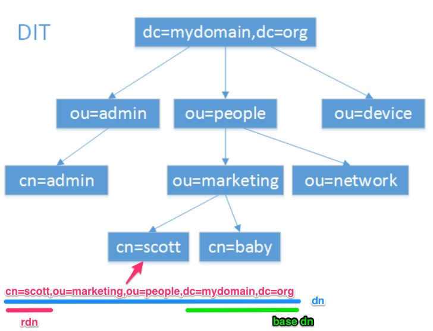

 
 LDAP信息模型是基于条目的. 一个条目是一个属性的集合，有一个全球唯一的识别名（ DN ）. DN用于明白无误地标识条目. 每个条目的属性有一个类型和一个或多个值. 该类型通常是可记忆的字符串，如“ cn ”就是标识通用名称，或“电子邮件”就是电子邮件地址。
 
 值的语法依赖于属性类型. 例如, 一个 cn 属性可以包含一个值 Babs Jensen. 一个 mail 属性可以包含值"babs@example.com". 一个 jpegPhoto 属性将包含一个JPEG (binary) 格式的照片.
 
##  LDAP简称对应
|简称|描述|
|---|---|
|o| organization（组织-公司）|
|ou| – organization unit（组织单-部门）|
|c | countryName（国家）|
|dc | domainComponent（域名）|
|sn | suer name（真实名称）|
|cn | common name（常用名称）|
 
### 条目(Entry)

条目，也叫记录项，是LDAP中最基本的颗粒

属性（Attribute）

