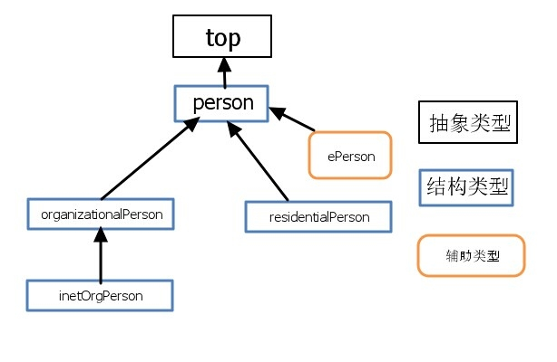
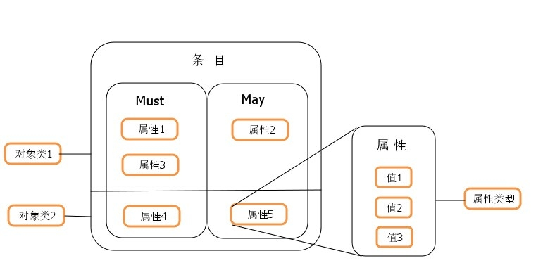

 
 LDAP信息模型是基于条目的. 一个条目是一个属性的集合，有一个全球唯一的识别名（ DN ）. DN用于明白无误地标识条目. 每个条目的属性有一个类型和一个或多个值. 该类型通常是可记忆的字符串，如“ cn ”就是标识通用名称，或“电子邮件”就是电子邮件地址。
 
 值的语法依赖于属性类型. 例如, 一个 cn 属性可以包含一个值 Babs Jensen. 一个 mail 属性可以包含值"babs@example.com". 一个 jpegPhoto 属性将包含一个JPEG (binary) 格式的照片.
 
##  LDAP简称对应
|简称|描述|
|---|---|
|o| organization（组织-公司）|
|ou| – organization unit（组织单-部门）|
|c | countryName（国家）|
|dc | domainComponent（域名）|
|sn | suer name（真实名称）|
|cn | common name（常用名称）|
 
### 条目(Entry)

条目，也叫记录项，是LDAP中最基本的颗粒，每一个条目都有一个唯一的标识名（Distinguished Name, DN）。如上图中的 'cn=baby,ou=marketing,ou=people,dc=mydomain,dc=org'。

DN 中有三个组成：

- 相对标识（Relational DN, RDN）：一般是 DN 中最左边的部分，上例中的 cn=baby。
- 组织机构（Organization Unit, OU）：标记条目所属的组织，上例中的 ou=marketing,ou=people。
- 基准 DN（Base DN）：LDAP 目录树的根，上例中的 dc=mydomain,dc=org。

Base DN 有三种命名方式，可以按需选择：

- X.500 格式：形如 dc="Foobar, Inc",dc=US。
- 以 internet 地址表示：形如 dc=foobar.com。
- 以 DNS 域名的不同部分来表示（推荐）：形如 dc=foobar,dc=com。

### 属性（Attribute）

### 对象类（ObjectClass）
对象类是属性的集合，项目可以通过选择对象类来获得属性。如果两个对象类中有相同的属性，条目只会保存其中一个。

一共有三种对象类：

结构类型（STRUCTURAL）
结构类是是最基本的类型
每个条目属于且仅属于一个结构型对象类
抽象类型（ABSTRACT）
抽象类可以被继承，是其他类型的模板
条目不能直接继承抽象类
top 对象类是所有抽象类的根类
辅助类型（AUXILIARY）
辅助类型类规定了对象实体的扩展属性
每个条目至少有一个结构性对象类

### 模式（Schema）
模式是对象类的集合。

[LDAP 笔记](https://blog.laisky.com/p/ldap/)

[LDAP服务器的概念和原理简单介绍](https://segmentfault.com/a/1190000002607140#articleHeader7)

[OpenLDAP2.4管理员指南](	http://wiki.jabbercn.org/index.php/OpenLDAP2.4%E7%AE%A1%E7%90%86%E5%91%98%E6%8C%87%E5%8D%97#.E4.BB.80.E4.B9.88.E6.98.AFLDAP.3F)

