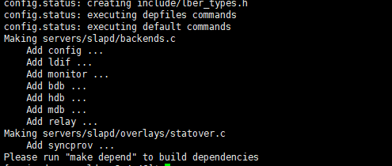

```
// 下载
wget http://gpl.savoirfairelinux.net/pub/mirrors/openldap/openldap-release/openldap-2.4.46.tgz

// 解压
gunzip -c openldap-2.4.46.tgz | tar xvfB -

// 检测系统环境
./configure

```

	
之后构建软件
```
// 先构建依赖关系
make depend

// 再编译软件
make
```
	
	