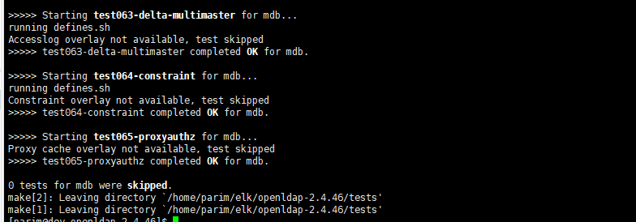

## 准备
```
# 下载
wget http://gpl.savoirfairelinux.net/pub/mirrors/openldap/openldap-release/openldap-2.4.46.tgz

# 解压
gunzip -c openldap-2.4.46.tgz | tar xvfB -

# 检测系统环境
./configure

```

	
## 构建软件
```
# 先构建依赖关系
make depend

# 再编译软件
make

# 检测构建--这一步等待时间略长
make test

```


## 安装
```
// 安装软件
su root -c 'make install'
```
## 配置

### 设置加密的密码

```
slappasswd
```
根据提示输入两遍密码，即可获得加密后端密码，如：
```
{SSHA}LFvNxLuy20L00BudQ8MYgv8ZdxRSXNxd
```


### 修改 slapd.conf

```
// 进入
cd /usr/local/etc/openldap/

sudo vi slapd.conf
```

根据需求导入schema，此处需要inetorgperson，故添加如下：
```
include        /usr/local/etc/openldap/schema/cosine.schema
include        /usr/local/etc/openldap/schema/inetorgperson.schema
```
修改suffix、rootdn、rootpw、directory
```
suffix		"dc=windcoder,dc=com"
rootdn     "cn=admin,dc=windcoder,dc=com"
rootpw     {SSHA}LFvNxLuy20L00BudQ8MYgv8ZdxRSXNxd
directory	/usr/local/etc/openldap/datas/openldap-data
```
此处的directory目录，不会自动创建，需手动创建，不然会造成无法启动。
## 启动
```
sudo /usr/local/libexec/slapd
```
查看启动状态：
```
ps -ef |grep slapd
```


创建
```
sudo vi test1.ldif
```

```
dn: dc=windcoder,dc=com
objectClass: top
objectClass: dcObject
objectClass: organization
dc: windcoder
o: windcoder-com


dn: ou=User,dc=windcoder,dc=com
objectclass: top
objectclass: person
objectclass: organizationalPerson
sn:Person
cn:Some-Person
```


