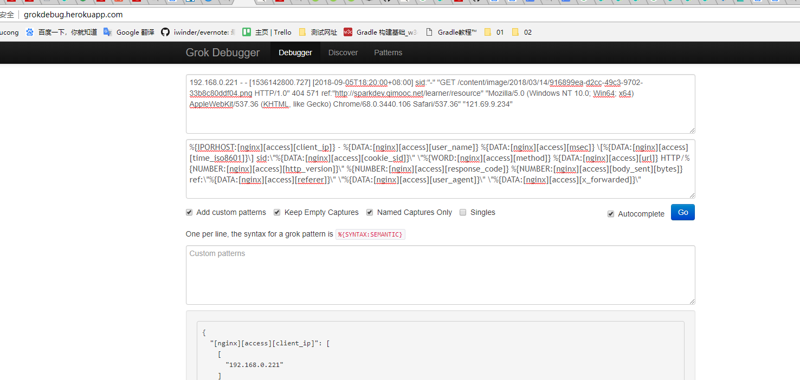

https://www.elastic.co/cn/downloads

```
wget https://artifacts.elastic.co/downloads/elasticsearch/elasticsearch-6.4.0.tar.gz
wget https://artifacts.elastic.co/downloads/logstash/logstash-6.4.0.tar.gz
wget https://artifacts.elastic.co/downloads/kibana/kibana-6.4.0-linux-x86_64.tar.gz
wget https://artifacts.elastic.co/downloads/beats/filebeat/filebeat-6.4.0-linux-x86_64.tar.gz
```
 5.0级以上版本至少需要JDK1.8.
 2.4的版本可在1.7

|ES  | JDK|
|----| --- |
| 0.90 | 1.6 |
| 1.3-2.4 | 1.7|
| 5.0+ | 1.8 |

```
wget https://download.elastic.co/elasticsearch/release/org/elasticsearch/distribution/tar/elasticsearch/2.4.6/elasticsearch-2.4.6.tar.gz

https://download.elastic.co/kibana/kibana/kibana-4.6.6-linux-x86_64.tar.gz

https://www.elastic.co/downloads/past-releases/logstash-2-4-1

https://download.elastic.co/beats/filebeat/filebeat-1.3.1-x86_64.tar.gz
```


## 安装elasticsearch
### 解压
```
tar -zxvf elasticsearch-6.4.0.tar.gz
```
### 指定JDK(可选)
修改elasticsearch启动脚本 
```
export JAVA_HOME=/home/parim/spark/apps/jdk1.8.0_144/    （此处配置的为刚下的1.8的配置目录）
export PATH=$JAVA_HOME/bin:$PATH

if [ -x "$JAVA_HOME/bin/java" ]; then
        JAVA="/home/parim/spark/apps/jdk1.8.0_144//bin/java"
else
        JAVA=`which java`
fi
```
完整配置如下
```
# 配置自己的jdk1.8
export JAVA_HOME=/home/parim/spark/apps/jdk1.8.0_144/
export PATH=$JAVA_HOME/bin:$PATH

source "`dirname "$0"`"/elasticsearch-env

ES_JVM_OPTIONS="$ES_PATH_CONF"/jvm.options
JVM_OPTIONS=`"$JAVA" -cp "$ES_CLASSPATH" org.elasticsearch.tools.launchers.JvmOptionsParser "$ES_JVM_OPTIONS"`
ES_JAVA_OPTS="${JVM_OPTIONS//\$\{ES_TMPDIR\}/$ES_TMPDIR} $ES_JAVA_OPTS"

# 自己添加的jdk判断
if [ -x "$JAVA_HOME/bin/java" ]; then
        JAVA="/home/parim/spark/apps/jdk1.8.0_144//bin/java"
else
        JAVA=`which java`
fi

cd "$ES_HOME"
# manual parsing to find out, if process should be detached
if ! echo $* | grep -E '(^-d |-d$| -d |--daemonize$|--daemonize )' > /dev/null; then
  exec \
    "$JAVA" \
    $ES_JAVA_OPTS \
    -Des.path.home="$ES_HOME" \
    -Des.path.conf="$ES_PATH_CONF" \
    -Des.distribution.flavor="$ES_DISTRIBUTION_FLAVOR" \
    -Des.distribution.type="$ES_DISTRIBUTION_TYPE" \
    -cp "$ES_CLASSPATH" \
    org.elasticsearch.bootstrap.Elasticsearch \
    "$@"
else
  exec \
    "$JAVA" \
    $ES_JAVA_OPTS \
    -Des.path.home="$ES_HOME" \
    -Des.path.conf="$ES_PATH_CONF" \
    -Des.distribution.flavor="$ES_DISTRIBUTION_FLAVOR" \
    -Des.distribution.type="$ES_DISTRIBUTION_TYPE" \
    -cp "$ES_CLASSPATH" \
    org.elasticsearch.bootstrap.Elasticsearch \
    "$@" \
    <&- &
  retval=$?
  pid=$!
  [ $retval -eq 0 ] || exit $retval
  if [ ! -z "$ES_STARTUP_SLEEP_TIME" ]; then
    sleep $ES_STARTUP_SLEEP_TIME
  fi
  if ! ps -p $pid > /dev/null ; then
    exit 1
  fi
  exit 0
fi

exit $?

```
[新版elasticsearch 启动时指定jdk1.8版本](https://blog.csdn.net/u010820857/article/details/81977186)

### 后端运行
```
./bin/elasticsearch
```
### 关闭
```
# 获取pid
netstat -nltp | grep java

kill `cat pid`
```
## kibana
后端运行
```
nohup ./bin/kibana &
```
### 关闭
```
netstat -nltp
```
[长期运行Kibana](https://blog.csdn.net/ASIA_kobe/article/details/53304447)

## logstash
[长期运行Kibana](https://blog.csdn.net/ASIA_kobe/article/details/53304447)

[linux logstash配置java环境](https://blog.csdn.net/singleee/article/details/50979768)

```
ps -ef |grep logstash


nohup ./bin/logstash   -f /home/parim/elk/logstash-6.4.0/config/01-logstash-initial.conf &
```


java.lang.UnsupportedOperationException: seccomp unavailable: CONFIG_SECCOMP not compiled into kernel, CONFIG_SECCOMP and CONFIG_SECCOMP_FILTER are needed

内核版本过低。[ElasticSearch 5.0.0 安装部署常见错误或问题](https://blog.csdn.net/u012246178/article/details/63253531)


[错误：无法找到或加载主类org.elasticsearch.tools.JavaVersionChecker](https://discuss.elastic.co/t/error-could-not-find-or-load-main-class-org-elasticsearch-tools-javaversionchecker/82213)

yum -y install sudo

[linux下elasticsearch 安装、配置及示例](https://blog.csdn.net/sinat_28224453/article/details/51134978)

[Elasticsearch unable to start - Permission issue](https://stackoverflow.com/questions/41057917/elasticsearch-unable-to-start-permission-issue)
---  No factory method found for class org.apache.logging.log4j.core.appender.RollingFileAppender ----
[elasticsearch](https://blog.csdn.net/qq_26712449/article/details/73346474)


[1]: max file descriptors [40960] for elasticsearch process is too low, increase to at least [65536]
[2]: max virtual memory areas vm.max_map_count [65530] is too low, increase to at least [262144]


```
// https://www.elastic.co/guide/en/elasticsearch/reference/master/setting-system-settings.html#sysconfig

# ulimit  临时修改
sudo su  ---进入root
ulimit -n 65536 --修改打开文件数的最大值
su elasticsearch --切回elasticsearch用户

# /etc/security/limits.conf 永久修改

elasticsearch  -  nofile  65536

```
```
// https://www.elastic.co/guide/en/elasticsearch/reference/master/vm-max-map-count.html#vm-max-map-count

// 临时
sysctl -w vm.max_map_count=262144

// 永久-需重启
/etc/sysctl.conf中设置vm.max_map_count=262144
```

[elasticsearch在CentOS环境下开机启动](https://www.cnblogs.com/zhi-leaf/p/8487404.html)

```


nohup ./filebeat -e -c filebeat.yml >/dev/null 2>&1 &  将所有标准输出及标准错误输出到/dev/null空设备，即没有任何输出

nohup ./filebeat -e -c filebeat.yml -d "publish" &

nohup ./filebeat -e -c filebeat.yml > filebeat.log &
```

```
ps -ef |grep filebeat

kill -9  进程号
```
http://grokdebug.herokuapp.com/

